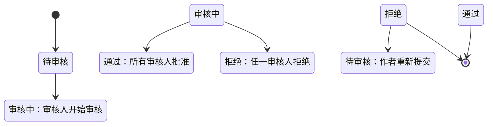

# 软件需求规格说明书 (Software Requirements Specification)

**文档编号：** SRS-2026-001  
**版本号：** V2.4  
**密级：** 内部保密  
**发布日期：** 2026 年 3 月  
**符合标准：** IEEE 830-1998

---

## 文档审批

| 角色 | 姓名 | 职位 | 签名 | 日期 |
|------|------|------|------|------|
| 编制人 | | 产品经理 | | |
| 审核人 | | 技术总监 | | |
| 批准人 | | 项目总监 | | |

---

## 修订历史

| 版本 | 日期 | 作者 | 修改说明 | 审核人 |
|------|------|------|---------|--------|
| V1.0 | 2026-03-14 | | 初始版本 | |
| V2.0 | 2026-03-16 | | 新增代码管理、代码审核模块；添加详细功能描述附录 | |
| V2.1 | 2026-03-17 | | 新增个人工作台、日历视图、文档管理、侧边栏导航、成员主页模块 | |
| V2.2 | 2026-03-18 | | 修正技术栈：Node.js→Python/FastAPI、PostgreSQL→MySQL、Redis 6→7 | |
| V2.3 | 2026-03-18 | | 修正遗留问题：Redis 版本、PostgreSQL 引用、补充前端技术栈 | |
| V2.4 | 2026-05-17 | | 明确一期 MVP、二期扩展、任务状态流和证据门禁验收规则 | |

---

## 目录

1. [引言](#1-引言)
2. [总体描述](#2-总体描述)
   - [2.8 发布范围与阶段划分](#28-发布范围与阶段划分)
3. [功能需求](#3-功能需求)
   - [3.1 用户管理模块](#31-用户管理模块)
   - [3.2 团队管理模块](#32-团队管理模块)
   - [3.3 项目管理模块](#33-项目管理模块)
   - [3.4 任务管理模块](#34-任务管理模块)
   - [3.5 协作沟通模块](#35-协作沟通模块)
   - [3.6 报表统计模块](#36-报表统计模块)
   - [3.7 个人工作台模块](#37-个人工作台模块)
   - [3.8 日历视图模块](#38-日历视图模块)
   - [3.9 文档管理模块](#39-文档管理模块)
   - [3.10 侧边栏导航模块](#310-侧边栏导航模块)
   - [3.11 团队成员主页模块](#311-团队成员主页模块)
   - [3.12 代码管理模块](#312-代码管理模块)
   - [3.13 代码审核模块](#313-代码审核模块)
4. [非功能需求](#4-非功能需求)
5. [接口需求](#5-接口需求)
6. [约束条件](#6-约束条件)
7. [附录](#7-附录)

---

## 1. 引言

### 1.1 目的

本文档描述团队协作任务管理系统（TTCS）的完整需求，包括功能需求、非功能需求、接口需求等。本文档将作为：

- 系统设计的基础依据
- 开发团队的实现指南
- 测试团队的验收标准
- 项目验收的基准文档

### 1.2 范围

本系统是一个面向小型创业团队（5-15 人）的任务协作平台，主要功能包括：

- 用户与团队管理
- 项目与看板管理
- 任务全生命周期管理
- 个人工作台（一期 MVP 行动入口）与日历视图（二期扩展）
- 文档管理与文件归档（一期作为交付物证据，二期增强归档能力）
- 团队成员主页（二期扩展）
- 代码管理与审核（一期开启代码任务证据链，二期增强 AI/Agent 评审）
- 团队协作与沟通
- 报表统计与报表

### 1.3 定义、首字母缩写词和缩略语

| 术语 | 定义 |
|------|------|
| TTCS | Team Task Collaboration System，团队协作任务管理系统 |
| SRS | Software Requirements Specification，软件需求规格说明书 |
| HLD | High-Level Design，概要设计 |
| LLD | Low-Level Design，详细设计 |
| API | Application Programming Interface，应用程序接口 |
| REST | Representational State Transfer，表述状态转移 |
| JWT | JSON Web Token，一种认证令牌格式 |
| WebSocket | 一种网络通信协议，提供全双工通信 |
| Kanban | 看板，一种可视化管理方法 |
| CRUD | Create, Read, Update, Delete，基本数据操作 |
| Git | 分布式版本控制系统 |
| PR | Pull Request，拉取请求（GitHub） |
| MR | Merge Request，合并请求（GitLab） |
| Diff | Difference，差异对比 |
| MVP | Minimum Viable Product，最小可行产品 |
| 验收门禁 | 任务提交验收前必须满足的客观检查条件 |
| 验收 Review | Owner 或项目经理对任务完成质量进行人工确认 |
| AI/Agent 评审 | 二期能力，由 AI 或自动化 Agent 对代码任务提供辅助评审意见 |

### 1.4 参考文献

| 编号 | 文档名称 | 来源 |
|------|---------|------|
| [1] | IEEE 830-1998 软件需求规格说明书标准 | IEEE |
| [2] | 项目章程 PC-2026-001 | 本项目 |
| [3] | 用户需求清单 | 本项目 |
| [4] | GitHub API v3 文档 | https://docs.github.com/en/rest |
| [5] | GitLab API v4 文档 | https://docs.gitlab.com/ee/api/ |

### 1.5 文档概述

本文档第 2 章描述产品概述；第 3 章详细描述所有功能需求；第 4 章定义非功能需求；第 5 章定义接口需求；第 6 章描述约束条件；第 7 章为附录。

---

## 2. 总体描述

### 2.1 产品视角

本系统是一个基于 Web 的应用系统，采用 B/S 架构，用户通过浏览器访问。

### 2.2 产品功能概述

| 功能模块 | 功能描述 |
|---------|---------|
| 用户管理 | 用户注册、登录、个人信息管理、密码找回 |
| 团队管理 | 创建团队、邀请成员、角色分配、成员管理 |
| 项目管理 | 创建项目、项目配置、成员分配、看板定义 |
| 任务管理 | 任务创建、编辑、删除、状态流转、任务依赖、子任务、工作日志、证据门禁验收 |
| 协作沟通 | 发表评论、@提及、活动动态、实时通知、文件上传 |
| 报表统计 | 燃尽图、任务分布、工时统计、阻塞报告、项目进度 |
| 个人工作台 | 今日待办、待写日志、待提交验收、待我验收、被打回任务、项目进度（一期 MVP） |
| 日历视图 | 日历形式展示任务、日/周/月视图、外部日历同步（二期扩展） |
| 文档管理 | 文件上传下载、项目文档库、交付物证据、文件归档 |
| 侧边栏导航 | 主导航、项目快捷入口、团队成员在线状态（新增） |
| 成员主页 | 个人信息、负责任务、负责项目、工作日志（新增） |
| 代码管理 | 仓库绑定、提交历史、代码浏览、Diff 对比、代码任务证据关联 |
| 代码审核 | 创建审核、分配审核人、文件级评论、审核状态流转、代码任务验收证据 |
| 系统管理 | 系统日志、数据备份、系统配置 |

### 2.3 用户角色描述

#### 2.3.1 系统管理员 (Administrator)

| 属性 | 描述 |
|------|------|
| 职责 | 系统配置、用户管理、数据备份、系统监控 |
| 技能 | 熟悉系统架构、运维 |
| 使用频率 | 每日 |
| 权限 | 系统管理权限 |

#### 2.3.2 项目经理 (Project Manager)

| 属性 | 描述 |
|------|------|
| 职责 | 项目规划、任务分配、进度跟踪、团队协调 |
| 技能 | 熟悉项目管理流程 |
| 使用频率 | 每日多次 |
| 权限 | 项目管理权限 |

#### 2.3.3 团队成员 (Team Member)

| 属性 | 描述 |
|------|------|
| 职责 | 任务执行、状态更新、协作沟通 |
| 技能 | 基本电脑操作 |
| 使用频率 | 每日多次 |
| 权限 | 任务操作与协作权限 |

#### 2.3.4 代码审核人 (Code Reviewer)（新增）

| 属性 | 描述 |
|------|------|
| 职责 | 审核代码变更、提供反馈意见、批准或拒绝代码合并 |
| 技能 | 熟悉代码规范、具备技术评审能力 |
| 使用频率 | 每日多次 |
| 权限 | 代码审核权限、评论权限 |
| 说明 | 可由技术负责人、高级开发人员或项目经理担任 |

### 2.4 运行环境

#### 2.4.1 服务器环境

| 类别 | 要求 |
|------|------|
| 操作系统 | Linux (Ubuntu 22.04 LTS) |
| Web 服务器 | Nginx 1.18+ |
| 应用服务器 | Python 3.10+ + FastAPI 0.100+ |
| 数据库 | MySQL 8.0+ |
| 缓存 | Redis 7+ |
| 内存 | 8GB+ |
| 存储 | 100GB+ SSD |

#### 2.4.2 客户端环境

| 类别 | 要求 |
|------|------|
| 浏览器 | Chrome 90+ / Firefox 88+ / Safari 14+ / Edge 90+ |
| 分辨率 | 1280×720 及以上 |
| 网络 | 宽带互联网连接 |
| JavaScript | 必须启用 |

#### 2.4.3 前端技术栈

| 类别 | 技术选型 |
|------|---------|
| 前端框架 | Vue 3.3+ |
| 构建工具 | Vite 5.x |
| 状态管理 | Pinia 2.x |
| 路由管理 | Vue Router 4.x |
| HTTP 客户端 | Axios 1.x |
| UI 组件库 | Ant Design Vue 4.x |
| Node.js 版本 | 18+ (通过 NVM 管理) |

### 2.5 设计和实现约束

| 约束编号 | 约束描述 | 影响 |
|---------|---------|------|
| C1 | 前端使用 TypeScript 编写 | 提高代码质量和可维护性 |
| C2 | 后端使用 Python 3.10+ 编写 | 简洁易读、开发效率高 |
| C3 | 前后端分离架构 | 前端和后端独立部署 |
| C4 | RESTful API 设计规范 | 统一接口规范 |
| C5 | 响应式设计 | 支持多终端屏幕尺寸 |
| C6 | 符合 GDPR 数据保护要求 | 用户数据加密存储 |
| C7 | 前端遵循 ESLint 规范 | 统一代码风格 |
| C8 | 后端遵循 Ruff 代码规范 | 统一代码风格 |
| C9 | Git 平台 OAuth 2.0 集成 | 支持 GitHub 登录和 API 访问 |

### 2.6 用户文档

| 文档名称 | 目标读者 | 交付时间 |
|---------|---------|---------|
| 用户手册 | 终端用户 | 系统上线前 |
| 管理员指南 | 系统管理员 | 系统上线前 |
| API 文档 | 开发人员 | 设计阶段 |
| 部署手册 | 运维人员 | 系统上线前 |
| 代码审核指南 | 代码审核人 | 系统上线前 |

### 2.7 依赖关系

| 编号 | 依赖/外部服务 |
|------|--------------|
| A1 | 第三方 Git 平台（GitHub）OAuth 认证 |
| A2 | 第三方 Git 平台 API 用于代码数据同步 |
| D1 | MySQL 8.0 数据库服务 |
| D2 | Redis 7 缓存服务 |
| D3 | SMTP 邮件服务用于通知邮件 |
| D4 | 对象存储服务用于文件上传 |

### 2.8 发布范围与阶段划分

本项目采用分阶段交付。V2.4 起，需求范围以“一期 MVP 先证明真实交付闭环，二期再扩展平台能力”为原则。

#### 2.8.1 一期 MVP 范围

一期 MVP 目标是完成“每日站会 + 个人执行 + 任务验收”的真实交付闭环，保证系统不是单纯任务看板。

| 模块 | 一期范围 |
|------|---------|
| 用户与认证 | 注册、登录、JWT 认证、基础个人信息 |
| 团队与项目 | 团队创建、成员邀请、项目创建、项目成员管理、基础角色 |
| 看板与任务 | 默认看板列、任务创建/编辑/软删除、任务参与者、子任务、依赖 |
| 工作日志 | 工时、工作内容、阻塞标记、阻塞原因、日志权限基础规则 |
| 任务验收 | 任务类型、验收门禁、提交验收、Owner/项目经理 Review、打回修改、验收历史 |
| 个人工作台 | 今日待办、待写日志、阻塞中、待提交验收、待我验收、被打回任务 |
| 通知与活动 | WebSocket 通知、任务动态、验收相关通知、阻塞通知 |
| 报表统计 | 项目进度、任务分布、工时统计、阻塞任务报告、验收统计基础数据 |
| 文档管理 | 交付物上传、下载、删除、作为文档任务验收证据 |
| 代码管理与审核 | 代码任务可关联 Commit、PR/MR 或审核记录；一期可使用模拟或手工录入数据支撑验收证据链 |

#### 2.8.2 二期扩展范围

二期在一期闭环稳定后扩展平台能力和智能化能力。

| 模块 | 二期范围 |
|------|---------|
| 日历视图 | 日/周/月视图、外部日历同步、iCal 导入导出 |
| 成员主页 | 成员工作统计、负责项目、最近工作日志、可见性细化 |
| 文档归档 | 文档版本、归档策略、容量管理、批量整理 |
| 代码集成增强 | 真实 GitHub/GitLab Webhook、提交自动同步、代码浏览增强 |
| AI/Agent 评审 | 对代码任务输出变更摘要、风险点、测试建议、验收标准匹配度，不拥有最终完成权 |
| 规则扩展 | 项目级验收模板、任务类型自定义、多角色会签、验收风险评分 |
| 国际化 | 英文界面、多时区体验增强 |

#### 2.8.3 明确暂不纳入一期的内容

- 完整规则引擎。
- 真实 AI/Agent 代码评审调用。
- 多平台 Git 深度同步。
- 外部日历双向同步。
- 移动端 App。
- 多语言界面。

---

## 3. 功能需求

### 3.1 用户管理模块

#### 3.1.1 用户注册 (FR-USER-001)

| 属性 | 描述 |
|------|------|
| **优先级** | 高 |
| **描述** | 新用户通过邮箱注册账号 |
| **输入** | 邮箱地址、密码、确认密码、验证码 |
| **处理** | 1. 验证邮箱格式<br>2. 验证密码强度<br>3. 检查邮箱是否已注册<br>4. 发送验证邮件<br>5. 创建用户账号 |
| **输出** | 注册成功/失败消息 |
| **前置条件** | 用户未注册 |
| **后置条件** | 用户账号创建，状态为未验证 |

**业务规则**
- BR-USER-001：密码长度 8-20 位，包含字母和数字
- BR-USER-002：密码需加密存储后验证
- BR-USER-003：验证邮件有效期 30 分钟

#### 3.1.2 用户登录 (FR-USER-002)

| 属性 | 描述 |
|------|------|
| **优先级** | 高 |
| **描述** | 已注册用户通过邮箱密码登录系统 |
| **输入** | 邮箱地址、密码 |
| **处理** | 1. 验证用户信息<br>2. 检查账号状态<br>3. 生成 JWT 令牌<br>4. 记录登录日志 |
| **输出** | 登录成功返回 Token，失败返回错误信息 |
| **前置条件** | 用户已注册并验证 |
| **后置条件** | 用户登录状态更新 |

**业务规则**
- BR-USER-004：连续 5 次登录失败锁定账号 30 分钟
- BR-USER-005：Token 有效期 24 小时
- BR-USER-006：支持记住登录状态（7 天）

#### 3.1.3 密码找回 (FR-USER-003)

| 属性 | 描述 |
|------|------|
| **优先级** | 中 |
| **描述** | 用户通过邮箱找回密码 |
| **输入** | 注册邮箱 |
| **处理** | 1. 验证邮箱是否存在<br>2. 生成重置令牌<br>3. 发送重置邮件<br>4. 验证重置令牌<br>5. 更新密码 |
| **输出** | 重置成功/失败消息 |
| **前置条件** | 用户已注册 |
| **后置条件** | 用户密码更新，旧 Token 失效 |

**业务规则**
- BR-USER-007：重置令牌有效期 1 小时
- BR-USER-008：重置令牌使用后立即失效

#### 3.1.4 个人信息管理 (FR-USER-004)

| 属性 | 描述 |
|------|------|
| **优先级** | 中 |
| **描述** | 用户可以查看和编辑个人信息 |
| **输入** | 头像、昵称、手机号、简介 |
| **处理** | 1. 验证用户身份<br>2. 验证输入合法性<br>3. 更新用户信息 |
| **输出** | 更新成功/失败消息 |
| **前置条件** | 用户已登录 |
| **后置条件** | 用户信息更新 |

**可修改字段：**
- 昵称（2-20 字符）
- 头像（JPG/PNG，最大 2MB）
- 手机号（可选）
- 个人简介（最多 200 字符）

---

### 3.2 团队管理模块

#### 3.2.1 创建团队 (FR-TEAM-001)

| 属性 | 描述 |
|------|------|
| **优先级** | 高 |
| **描述** | 用户可以创建新团队并担任团队管理员 |
| **输入** | 团队名称、团队描述、团队头像 |
| **处理** | 1. 验证输入合法性<br>2. 检查团队名称是否重复<br>3. 创建团队记录<br>4. 自动将创建者设为管理员 |
| **输出** | 团队创建成功/失败消息 |
| **前置条件** | 用户已登录 |
| **后置条件** | 团队创建，创建者为管理员 |

**业务规则**
- BR-TEAM-001：团队名称 2-50 字符，全局唯一
- BR-TEAM-002：每个用户最多创建 5 个团队
- BR-TEAM-003：团队描述最多 500 字符

#### 3.2.2 邀请成员 (FR-TEAM-002)

| 属性 | 描述 |
|------|------|
| **优先级** | 高 |
| **描述** | 团队管理员可以邀请其他用户加入团队 |
| **输入** | 被邀请人邮箱、邀请角色 |
| **处理** | 1. 验证操作权限<br>2. 检查邮箱是否已注册<br>3. 创建邀请记录<br>4. 发送邀请邮件 |
| **输出** | 邀请发送成功/失败消息 |
| **前置条件** | 用户是团队管理员 |
| **后置条件** | 邀请记录创建，等待对方接受 |

**业务规则**
- BR-TEAM-004：邀请链接有效期 7 天
- BR-TEAM-005：同一用户同时只能有一个待处理邀请
- BR-TEAM-006：邀请角色分为两种：管理员/成员

#### 3.2.3 成员管理 (FR-TEAM-003)

| 属性 | 描述 |
|------|------|
| **优先级** | 高 |
| **描述** | 团队管理员可以管理团队成员 |
| **输入** | 成员 ID、操作类型 |
| **处理** | 1. 验证操作权限<br>2. 执行操作（角色变更/移除）<br>3. 记录操作日志 |
| **输出** | 操作成功/失败消息 |
| **前置条件** | 用户是团队管理员 |
| **后置条件** | 成员状态或角色变更 |

**支持操作：**
- 变更成员角色
- 移除团队成员
- 查看成员列表

**业务规则**
- BR-TEAM-007：团队必须至少有一个管理员
- BR-TEAM-008：不能移除自己

---

### 3.3 项目管理模块

#### 3.3.1 创建项目 (FR-PROJ-001)

| 属性 | 描述 |
|------|------|
| **优先级** | 高 |
| **描述** | 团队成员可以创建新项目 |
| **输入** | 项目名称、项目描述、开始日期、结束日期、项目头像 |
| **处理** | 1. 验证输入合法性<br>2. 验证日期有效性<br>3. 创建项目记录<br>4. 自动将创建者设为项目经理 |
| **输出** | 项目创建成功/失败消息 |
| **前置条件** | 用户是团队成员，已登录 |
| **后置条件** | 项目创建，创建者为项目经理 |

**业务规则**
- BR-PROJ-001：项目名称 2-100 字符
- BR-PROJ-002：结束日期必须晚于开始日期
- BR-PROJ-003：项目描述最多 1000 字符

#### 3.3.2 项目看板配置 (FR-PROJ-002)

| 属性 | 描述 |
|------|------|
| **优先级** | 高 |
| **描述** | 项目经理可以自定义项目看板列 |
| **输入** | 列名称、列颜色、列顺序 |
| **处理** | 1. 验证操作权限<br>2. 创建/编辑/删除列<br>3. 更新列顺序 |
| **输出** | 配置成功/失败消息 |
| **前置条件** | 用户是项目经理 |
| **后置条件** | 看板配置更新 |

**业务规则**
- BR-PROJ-004：一期默认列：待办、进行中、待验收、打回修改、已完成
- BR-PROJ-005：最多支持 10 个列
- BR-PROJ-006：列名称 2-20 字符

#### 3.3.3 项目成员管理 (FR-PROJ-003)

| 属性 | 描述 |
|------|------|
| **优先级** | 高 |
| **描述** | 项目经理可以管理项目成员 |
| **输入** | 成员 ID、项目角色 |
| **处理** | 1. 验证操作权限<br>2. 从团队选择成员<br>3. 分配项目角色<br>4. 发送通知 |
| **输出** | 分配成功/失败消息 |
| **前置条件** | 用户是项目经理 |
| **后置条件** | 项目成员列表更新 |

**项目角色：**
- 项目经理（Project Manager）
- 技术负责人（Tech Lead）
- 开发人员（Developer）
- 测试人员（Tester）

---

### 3.4 任务管理模块

#### 3.4.1 创建任务 (FR-TASK-001)

| 属性 | 描述 |
|------|------|
| **优先级** | 高 |
| **描述** | 项目成员可以创建新任务 |
| **输入** | 任务标题、任务描述、任务类型、优先级、截止日期、Owner、参与者、所属列、标签 |
| **处理** | 1. 验证输入合法性<br>2. 创建任务记录<br>3. 通知负责人<br>4. 记录活动日志 |
| **输出** | 任务创建成功/失败消息 |
| **前置条件** | 用户是项目成员，已登录 |
| **后置条件** | 任务创建 |

**业务规则**
- BR-TASK-001：任务标题 2-200 字符
- BR-TASK-002：任务描述最多 10000 字符
- BR-TASK-003：优先级分为：紧急、高、中、低
- BR-TASK-004：Owner 和参与者必须是项目成员
- BR-TASK-004A：任务类型分为普通任务（GENERAL）、文档任务（DOCUMENT）、代码任务（CODE）
- BR-TASK-004B：每个任务最多 5 名参与者

#### 3.4.2 编辑任务 (FR-TASK-002)

| 属性 | 描述 |
|------|------|
| **优先级** | 高 |
| **描述** | 任务负责人或项目经理可以编辑任务 |
| **输入** | 任务 ID、要修改的字段 |
| **处理** | 1. 验证编辑权限<br>2. 验证输入合法性<br>3. 更新任务记录<br>4. 记录修改历史<br>5. 通知相关人员 |
| **输出** | 更新成功/失败消息 |
| **前置条件** | 用户有编辑权限 |
| **后置条件** | 任务信息更新 |

**可编辑字段：**
- 标题、描述
- 任务类型
- 优先级、截止日期
- Owner、参与者、所属列
- 标签、附件

#### 3.4.3 删除任务 (FR-TASK-003)

| 属性 | 描述 |
|------|------|
| **优先级** | 中 |
| **描述** | 项目经理可以删除任务 |
| **输入** | 任务 ID |
| **处理** | 1. 验证删除权限<br>2. 软删除任务（标记删除状态）<br>3. 记录操作日志 |
| **输出** | 删除成功/失败消息 |
| **前置条件** | 用户是项目经理 |
| **后置条件** | 任务状态变为已删除 |

**业务规则**
- BR-TASK-005：删除后 30 天内可恢复
- BR-TASK-006：有子任务的任务不能直接删除

#### 3.4.4 任务状态流转 (FR-TASK-004)

| 属性 | 描述 |
|------|------|
| **优先级** | 高 |
| **描述** | 任务按证据门禁验收闭环进行状态流转 |
| **输入** | 任务 ID、目标列 ID |
| **处理** | 1. 验证操作权限<br>2. 验证状态流转合法性<br>3. 如进入待验收则检查验收门禁<br>4. 更新任务状态<br>5. 记录活动日志并通知相关人员 |
| **输出** | 状态更新成功/失败消息 |
| **前置条件** | 用户是项目成员 |
| **后置条件** | 任务状态更新 |

**状态流转规则：**
```
待办 → 进行中 → 待验收 → 已完成 → 已关闭
                  ↑      │
                  │      ↓
               打回修改 ←
```

**业务规则**
- BR-TASK-021：任务参与者只能将任务提交到待验收，不能直接置为已完成
- BR-TASK-022：进入待验收前必须满足对应任务类型的验收门禁
- BR-TASK-023：待验收任务只能由 Owner 或项目经理执行通过、打回、要求补充证据
- BR-TASK-024：阻塞是任务风险标记，不作为主状态；存在未解除阻塞时禁止提交验收
- BR-TASK-025：已完成任务进入已关闭前必须保留验收记录和证据快照

#### 3.4.5 子任务管理 (FR-TASK-005)

| 属性 | 描述 |
|------|------|
| **优先级** | 中 |
| **描述** | 任务可以分解为子任务，支持多级嵌套和进度自动计算 |
| **输入** | 父任务 ID、子任务标题、子任务描述、子任务负责人 |
| **处理** | 1. 验证输入合法性<br>2. 创建子任务记录<br>3. 建立父子任务关系<br>4. 更新父任务进度 |
| **输出** | 子任务创建成功/失败消息 |
| **前置条件** | 父任务存在，用户有编辑权限 |
| **后置条件** | 子任务创建，父任务进度更新 |

**业务规则**
- BR-TASK-007：子任务最多 3 级嵌套
- BR-TASK-008：父任务进度=已完成子任务数/子任务总数×100%
- BR-TASK-009：子任务可独立分配负责人
- BR-TASK-010：每个任务最多 5 个子任务
- BR-TASK-011：子任务完成时自动通知父任务负责人
- BR-TASK-012：子任务创建时自动记录创建人和创建时间

#### 3.4.6 任务依赖 (FR-TASK-006)

| 属性 | 描述 |
|------|------|
| **优先级** | 低 |
| **描述** | 任务之间可以设置依赖关系 |
| **输入** | 任务 ID、依赖任务 ID、依赖类型 |
| **处理** | 1. 验证依赖关系<br>2. 检查循环依赖<br>3. 创建依赖记录 |
| **输出** | 依赖设置成功/失败消息 |
| **前置条件** | 任务已存在 |
| **后置条件** | 任务依赖关系创建 |

**依赖类型：**
- 完成 - 开始 (FS)：前置任务完成后，本任务才能开始
- 开始 - 开始 (SS)：前置任务开始后，本任务才能开始
- 完成 - 完成 (FF)：前置任务完成后，本任务才能完成

**业务规则**
- BR-TASK-013：禁止循环依赖
- BR-TASK-014：依赖任务必须在同一项目

#### 3.4.7 工作日志 (FR-TASK-007)

| 属性 | 描述 |
|------|------|
| **优先级** | 中 |
| **描述** | 任务执行者可以记录工作日志，追踪任务进展和工时投入 |
| **输入** | 任务 ID、工时（小时）、工作日期、工作内容、工作类型、关联代码提交 |
| **处理** | 1. 验证任务归属和用户权限<br>2. 创建工作日志记录<br>3. 更新任务进度并通知项目负责人<br>4. 如关联代码提交，自动验证提交哈希有效性 |
| **输出** | 工作日志记录成功/失败消息 |
| **前置条件** | 用户是任务负责人或项目成员 |
| **后置条件** | 工作日志创建，任务工时累计更新 |

**业务规则**
- BR-TASK-015：工时单位为小时，最小 0.5 小时，最大 24 小时
- BR-TASK-016：只能记录过去 30 天的工作日志
- BR-TASK-017：工作日志创建后 24 小时内可编辑
- BR-TASK-018：工作内容支持 Markdown 格式，最多 5000 字符
- BR-TASK-019：关联代码提交时必须填写提交哈希，至少 10 字符
- BR-TASK-020：每周必须填写工作日志（强制要求）
- BR-TASK-020A：存在未解除阻塞的任务不能提交验收
- BR-TASK-020B：工作日志可作为任务验收证据

**代码提交集成：**
- 支持关联 Git Commit Hash
- 支持记录分支信息
- 一期支持手工关联或模拟关联代码提交
- 二期支持 Git Webhook 自动记录日志

#### 3.4.8 任务验收与完成确认 (FR-TASK-008)

| 属性 | 描述 |
|------|------|
| **优先级** | 高 |
| **描述** | 任务完成前必须经过分类型验收门禁和 Owner/项目经理人工 Review，确保“已完成”具备可追溯证据 |
| **输入** | 任务 ID、验收说明、验收证据、Review 结果、Review 说明 |
| **处理** | 1. 验证提交人是否为任务参与者或 Owner<br>2. 按任务类型执行验收门禁检查<br>3. 门禁通过后创建验收提交记录<br>4. 通知 Owner/项目经理 Review<br>5. Review 通过则任务进入已完成，打回则进入打回修改，证据不足则保持待验收 |
| **输出** | 验收提交成功/失败、Review 成功/失败消息 |
| **前置条件** | 任务存在且用户有权限访问 |
| **后置条件** | 创建验收历史，任务状态按 Review 结果更新 |

**任务类型：**

| 类型 | 编码 | 一期用途 |
|------|------|---------|
| 普通任务 | GENERAL | 需求、调研、配置、沟通等一般工作 |
| 文档任务 | DOCUMENT | 需要提交文档、附件或归档材料的任务 |
| 代码任务 | CODE | 需要关联 Commit、PR/MR 或代码审核记录的开发任务 |

**普通任务验收门禁：**

- BR-ACCEPT-001：子任务全部完成；若没有子任务，则必须填写验收说明
- BR-ACCEPT-002：至少存在 1 条有效工作日志
- BR-ACCEPT-003：不存在未解除阻塞
- BR-ACCEPT-004：提交人是任务参与者或 Owner
- BR-ACCEPT-005：验收说明不少于 10 字符

**文档任务验收门禁：**

- BR-ACCEPT-006：满足普通任务验收门禁
- BR-ACCEPT-007：至少上传或关联 1 个交付文档
- BR-ACCEPT-008：交付文档未被软删除，且 Owner/项目经理有访问权限

**代码任务验收门禁：**

- BR-ACCEPT-009：满足普通任务验收门禁
- BR-ACCEPT-010：至少关联 1 个 Commit、PR/MR 或代码审核记录
- BR-ACCEPT-011：若关联代码审核记录，则未解决评论数量必须为 0
- BR-ACCEPT-012：若 PR/MR 已同步状态，则状态不得为 rejected 或 closed without merge
- BR-ACCEPT-013：提交验收时必须填写功能自测说明或变更摘要

**人工 Review 规则：**

- BR-ACCEPT-014：Owner 和项目经理可以通过验收、打回任务或要求补充证据
- BR-ACCEPT-015：打回任务必须填写打回原因，原因不少于 10 字符
- BR-ACCEPT-016：要求补充证据时任务保持待验收状态
- BR-ACCEPT-017：验收通过后任务进入已完成，并记录验收人、验收时间和证据快照
- BR-ACCEPT-018：被打回任务重新提交时创建新的验收提交记录，历史 Review 不得覆盖

**AI/Agent 评审规划：**

- BR-ACCEPT-019：一期仅预留 AI/Agent 评审入口和数据结构，不执行真实 AI/Agent 调用
- BR-ACCEPT-020：二期 AI/Agent 评审仅作为辅助 reviewer，输出变更摘要、风险点、测试建议、验收标准匹配度
- BR-ACCEPT-021：AI/Agent 评审不拥有最终完成权，最终完成必须由 Owner 或项目经理确认


---

### 3.5 协作沟通模块

#### 3.5.1 发表评论 (FR-COMM-001)

| 属性 | 描述 |
|------|------|
| **优先级** | 高 |
| **描述** | 项目成员可以在任务下发表评论 |
| **输入** | 任务 ID、评论内容、@提及用户 |
| **处理** | 1. 验证输入合法性<br>2. 创建评论记录<br>3. 处理@提及<br>4. 发送通知给被提及用户 |
| **输出** | 评论成功/失败消息 |
| **前置条件** | 用户是项目成员 |
| **后置条件** | 评论创建，通知发送 |

**业务规则**
- BR-COMM-001：评论内容最多 2000 字符
- BR-COMM-002：评论创建后 5 分钟内可编辑
- BR-COMM-003：评论作者和项目经理可删除评论

#### 3.5.2 活动动态 (FR-COMM-002)

| 属性 | 描述 |
|------|------|
| **优先级** | 中 |
| **描述** | 系统自动记录项目内的重要活动 |
| **输入** | 自动捕获系统事件 |
| **处理** | 1. 捕获事件（任务创建、状态变更等）<br>2. 格式化活动信息<br>3. 存储活动记录 |
| **输出** | 活动记录 |
| **前置条件** | 无 |
| **后置条件** | 活动记录创建 |

**记录的活动类型：**
- 任务创建/编辑/删除
- 任务状态变更
- 任务分配变更
- 评论发布/删除
- 文件上传/删除
- 成员加入/离开

#### 3.5.3 实时通知 (FR-COMM-003)

| 属性 | 描述 |
|------|------|
| **优先级** | 高 |
| **描述** | 系统实时推送通知给用户 |
| **输入** | 通知事件 |
| **处理** | 1. 确定通知接收者<br>2. 创建通知记录<br>3. 通过 WebSocket 推送<br>4. 可选发送邮件 |
| **输出** | 通知记录 |
| **前置条件** | 通知事件触发 |
| **后置条件** | 通知记录创建，消息推送 |

**通知类型：**
- 任务分配通知
- @提及通知
- 任务截止提醒（提前 1 天、当天）
- 评论回复通知
- 项目邀请通知
- 任务提交验收通知
- 任务验收通过通知
- 任务打回修改通知
- 任务要求补充证据通知
- 阻塞未解除提醒通知

**业务规则**
- BR-COMM-004：用户可自定义通知偏好
- BR-COMM-005：通知保留 90 天
- BR-COMM-006：已读通知 7 天后自动清理


---

### 3.6 报表统计模块

#### 3.6.1 燃尽图 (FR-REPORT-001)

| 属性 | 描述 |
|------|------|
| **优先级** | 中 |
| **描述** | 显示项目剩余工作量随时间变化的趋势 |
| **输入** | 项目 ID、时间范围 |
| **处理** | 1. 获取任务数据<br>2. 计算每日剩余工时<br>3. 生成图表数据 |
| **输出** | 燃尽图数据（日期、剩余工时、理想工时） |
| **前置条件** | 项目已存在且有任务 |
| **后置条件** | 无 |

**业务规则**
- BR-REPORT-001：默认显示当前迭代（2 周）
- BR-REPORT-002：剩余工时=所有未完成任务的预估工时之和
- BR-REPORT-003：理想工时=总工时/迭代天数×剩余天数

#### 3.6.2 任务分布统计 (FR-REPORT-002)

| 属性 | 描述 |
|------|------|
| **优先级** | 中 |
| **描述** | 按不同维度统计任务分布 |
| **输入** | 项目 ID、统计维度、时间范围 |
| **处理** | 1. 获取任务数据<br>2. 按维度分组统计<br>3. 生成统计数据 |
| **输出** | 统计数据 |
| **前置条件** | 项目已存在且有任务 |
| **后置条件** | 无 |

**统计维度：**
- 按状态分布
- 按优先级分布
- 按负责人分布
- 按标签分布

#### 3.6.3 工时统计 (FR-REPORT-003)

| 属性 | 描述 |
|------|------|
| **优先级** | 中 |
| **描述** | 统计成员的工时投入情况 |
| **输入** | 项目 ID/团队 ID、时间范围 |
| **处理** | 1. 获取工作日志数据<br>2. 按成员汇总<br>3. 生成统计数据 |
| **输出** | 工时统计数据 |
| **前置条件** | 有工作日志记录 |
| **后置条件** | 无 |

**统计数据：**
- 成员总工时
- 成员日均工时
- 每日工时分布
- 预估 vs 实际对比

#### 3.6.4 阻塞任务报告 (FR-REPORT-004)

| 属性 | 描述 |
|------|------|
| **优先级** | 低 |
| **描述** | 列出阻塞任务清单，标注阻塞原因和持续时间，每日站会自动展示 |
| **输入** | 项目 ID、时间范围 |
| **处理** | 1. 获取任务列表并筛选阻塞任务<br>2. 计算阻塞时长<br>3. 生成报告数据 |
| **输出** | 阻塞任务列表（任务、阻塞原因、阻塞时长、负责人） |
| **前置条件** | 项目已存在 |
| **后置条件** | 无 |

**报告内容：**
- 阻塞任务清单（按阻塞时长排序）
- 每个任务的阻塞原因
- 任务负责人（Owner）信息
- 任务进入阻塞状态时间
- 阻塞任务是否影响验收提交

**使用场景：**
- 每日站会自动展示
- 项目经理每周审查

#### 3.6.5 项目进度 (FR-REPORT-005)

| 属性 | 描述 |
|------|------|
| **优先级** | 高 |
| **描述** | 显示项目整体进度和完成百分比 |
| **输入** | 项目 ID |
| **处理** | 1. 获取项目任务数据<br>2. 计算完成百分比<br>3. 生成进度状态 |
| **输出** | 进度数据 |
| **前置条件** | 项目已存在 |
| **后置条件** | 无 |

**进度计算：**
- 简单进度 = 已完成任务数 / 总任务数 × 100%
- 加权进度 = Σ(任务权重 × 任务状态) / Σ权重 × 100%
- 待验收任务不计入已完成任务
- 打回修改任务计入未完成任务

#### 3.6.6 任务验收统计 (FR-REPORT-006)

| 属性 | 描述 |
|------|------|
| **优先级** | 中 |
| **描述** | 统计任务验收效率和质量，用于项目经理识别交付风险 |
| **输入** | 项目 ID、时间范围 |
| **处理** | 1. 获取验收提交和 Review 记录<br>2. 统计通过率、打回次数、平均验收时长<br>3. 按任务类型和成员聚合数据 |
| **输出** | 验收统计数据 |
| **前置条件** | 项目存在且有验收记录 |
| **后置条件** | 无 |

**统计指标：**
- 待验收任务数
- 验收通过率
- 平均验收时长
- 打回任务数和打回次数
- 按任务类型统计验收分布
- 按成员统计提交验收和被打回情况

---

### 3.7 个人工作台模块（新增）

#### 3.7.1 查看个人工作台 (FR-WORKSPACE-001)

| 属性 | 描述 |
|------|------|
| **优先级** | 高 |
| **描述** | 用户进入系统后的个人工作概览页面，展示任务统计、项目进度、最近活动等 |
| **输入** | 用户 ID、筛选条件（可选） |
| **处理** | 1. 验证用户身份<br>2. 获取用户任务统计数据<br>3. 获取用户项目列表及进度<br>4. 获取最近活动动态<br>5. 获取今日概览数据<br>6. 组装并返回工作台数据 |
| **输出** | 个人工作台综合数据 |
| **前置条件** | 用户已登录 |
| **后置条件** | 无 |

**工作台展示内容：**
- 任务统计卡片（我的任务数、待办数、逾期数）
- 我的项目列表（按参与度排序，显示进度条）
- 最近活动流（我参与的任务动态，最多 10 条）
- 快捷操作（快速创建任务、新建项目）
- 今日概览（今日截止任务、待写日志数、阻塞任务数）
- 待提交验收任务队列
- 待我验收任务队列
- 被打回任务队列
- 阻塞中任务队列

**业务规则**
- BR-WORKSPACE-001：工作台数据实时刷新，每 5 分钟自动更新
- BR-WORKSPACE-002：任务统计包含所有状态的任务
- BR-WORKSPACE-003：项目列表按最近访问时间排序
- BR-WORKSPACE-004：活动流仅显示用户有权限查看的项目动态
- BR-WORKSPACE-005：今日概览数据每日零点重置
- BR-WORKSPACE-006：待我验收仅显示当前用户为 Owner 或项目经理的待验收任务
- BR-WORKSPACE-007：被打回任务必须显示最近一次打回原因和打回人
- BR-WORKSPACE-008：工作台优先展示需要用户行动的队列，而不是仅展示统计卡片

---

### 3.8 日历视图模块（新增）

#### 3.8.1 查看日历视图 (FR-CALENDAR-001)

| 属性 | 描述 |
|------|------|
| **优先级** | 高 |
| **描述** | 以日历形式展示任务截止日期和其他事件，支持日/周/月视图切换 |
| **输入** | 项目 ID（可选）、时间范围、视图类型（日/周/月） |
| **处理** | 1. 验证用户权限<br>2. 获取指定时间范围内的任务数据<br>3. 获取外部日历事件（如已同步）<br>4. 按日期分组整理数据<br>5. 返回日历视图数据 |
| **输出** | 日历视图数据（日期、事件列表、事件类型） |
| **前置条件** | 用户已登录 |
| **后置条件** | 无 |

**业务规则**
- BR-CALENDAR-001：支持日视图、周视图、月视图三种模式
- BR-CALENDAR-002：任务逾期显示红色标记，当天截止显示黄色标记
- BR-CALENDAR-003：支持拖拽任务修改截止日期
- BR-CALENDAR-004：支持双击日期格快速创建任务
- BR-CALENDAR-005：支持导入 iCal 格式外部日历
- BR-CALENDAR-006：支持导出 TTCS 日历为 iCal 格式
- BR-CALENDAR-007：外部日历事件显示为不同颜色区分

**事件类型：**
- 🔵 任务截止（蓝色）
- 🟢 会议（绿色）
- 🟡 假期（黄色）
- 🟣 外部日历事件（紫色）

---

### 3.9 文档管理模块（新增）

#### 3.9.1 上传文件 (FR-DOC-001)

| 属性 | 描述 |
|------|------|
| **优先级** | 高 |
| **描述** | 项目成员可以上传文件到项目文档库，用于项目内资料传递和归档 |
| **输入** | 项目 ID、文件、文件夹 ID（可选） |
| **处理** | 1. 验证用户项目成员身份<br>2. 验证文件类型和大小<br>3. 上传文件到对象存储<br>4. 创建文件记录<br>5. 记录活动日志 |
| **输出** | 上传成功/失败消息 |
| **前置条件** | 用户是项目成员，已登录 |
| **后置条件** | 文件上传成功，项目存储空间更新 |

**业务规则**
- BR-DOC-001：单文件最大 50MB
- BR-DOC-002：支持格式：PDF、DOC、DOCX、XLS、XLSX、PPT、PPTX、PNG、JPG、ZIP
- BR-DOC-003：每个项目默认存储空间 100MB
- BR-DOC-004：文件按项目归档存储
- BR-DOC-005：支持可选的文件夹分类（一级目录）
- BR-DOC-006：上传者可删除自己上传的文件

#### 3.9.2 下载文件 (FR-DOC-002)

| 属性 | 描述 |
|------|------|
| **优先级** | 高 |
| **描述** | 项目成员可以下载项目文档库中的文件 |
| **输入** | 文件 ID |
| **处理** | 1. 验证用户项目成员身份<br>2. 获取文件信息<br>3. 生成下载链接<br>4. 记录下载次数 |
| **输出** | 文件下载链接 |
| **前置条件** | 用户是项目成员 |
| **后置条件** | 文件下载次数 +1 |

**业务规则**
- BR-DOC-007：仅项目成员可下载该项目文件
- BR-DOC-008：下载链接有效期 1 小时
- BR-DOC-009：图片文件支持在线预览

#### 3.9.3 删除文件 (FR-DOC-003)

| 属性 | 描述 |
|------|------|
| **优先级** | 中 |
| **描述** | 删除项目文档库中的文件 |
| **输入** | 文件 ID |
| **处理** | 1. 验证删除权限（仅上传者可删除）<br>2. 软删除文件记录<br>3. 释放项目存储空间<br>4. 记录操作日志 |
| **输出** | 删除成功/失败消息 |
| **前置条件** | 用户是文件上传者或项目经理 |
| **后置条件** | 文件标记为已删除，存储空间释放 |

**业务规则**
- BR-DOC-010：删除后 30 天内可恢复
- BR-DOC-011：项目经理可删除任意文件

---

### 3.10 侧边栏导航模块（新增）

#### 3.10.1 侧边栏导航 (FR-NAV-001)

| 属性 | 描述 |
|------|------|
| **优先级** | 高 |
| **描述** | 系统全局侧边栏导航，提供主导航、项目快捷入口、团队成员状态展示 |
| **输入** | 用户 ID |
| **处理** | 1. 获取用户权限和偏好设置<br>2. 加载主导航菜单<br>3. 加载最近访问项目列表<br>4. 加载团队成员列表及在线状态<br>5. 返回侧边栏数据 |
| **输出** | 侧边栏导航数据 |
| **前置条件** | 用户已登录 |
| **后置条件** | 无 |

**侧边栏结构：**
- 主导航：首页、我的项目、我的任务、日历、报表、文档库
- 项目快捷入口：最近访问的项目（最多 5 个）
- 团队成员：显示团队成员头像、姓名、在线状态、负责任务数
- 底部导航：个人设置、退出登录

**业务规则**
- BR-NAV-001：侧边栏支持收起/展开（展开宽 280px，收起宽 64px）
- BR-NAV-002：在线状态通过 WebSocket 实时更新（30 秒心跳）
- BR-NAV-003：在线状态分为：在线（绿色）、忙碌（黄色）、离线（灰色）
- BR-NAV-004：点击团队成员可跳转成员主页
- BR-NAV-005：支持固定常用项目到侧边栏
- BR-NAV-006：显示未读通知角标

#### 3.10.2 查看团队成员状态 (FR-NAV-002)

| 属性 | 描述 |
|------|------|
| **优先级** | 高 |
| **描述** | 在侧边栏查看团队成员的在线状态和简要信息 |
| **输入** | 团队 ID 或项目 ID |
| **处理** | 1. 获取团队成员列表<br>2. 查询每个成员的在线状态<br>3. 统计每个成员负责任务数<br>4. 返回成员状态数据 |
| **输出** | 团队成员状态列表 |
| **前置条件** | 用户是团队或项目成员 |
| **后置条件** | 无 |

**在线状态定义：**
| 状态 | 颜色 | 触发条件 |
|------|------|---------|
| 在线 | 绿色 | WebSocket 连接中，5 分钟内有活动 |
| 忙碌 | 黄色 | 用户手动设置或 30 分钟无操作 |
| 离线 | 灰色 | WebSocket 断开或 60 分钟无活动 |

**业务规则**
- BR-NAV-007：成员按在线状态排序（在线优先）
- BR-NAV-008：显示成员负责任务数量（当前项目或所有项目）
- BR-NAV-009：支持搜索团队成员
- BR-NAV-010：用户可手动设置在线状态

---

### 3.11 团队成员主页模块（新增）

#### 3.11.1 查看成员主页 (FR-MEMBER-001)

| 属性 | 描述 |
|------|------|
| **优先级** | 高 |
| **描述** | 查看团队成员的个人主页，包含个人信息、负责任务、负责项目、工作日志等 |
| **输入** | 成员 ID、项目 ID（可选） |
| **处理** | 1. 验证查看权限<br>2. 获取成员基本信息<br>3. 获取成员工作统计数据<br>4. 获取成员负责任务列表<br>5. 获取成员负责项目列表<br>6. 获取成员最近工作日志<br>7. 返回成员主页综合数据 |
| **输出** | 成员主页数据 |
| **前置条件** | 用户已登录 |
| **后置条件** | 无 |

**主页展示内容：**
- 个人信息：头像、姓名、职位、邮箱、技能标签
- 工作统计：负责任务数、已完成任务数、本周工时、加入时间
- 当前负责任务：按优先级排序的任务列表
- 负责项目：参与的项目列表及进度
- 最近工作日志：个人工作日志时间线（受权限控制）
- 动态：个人活动记录

**业务规则**
- BR-MEMBER-001：工作日志可见性受权限控制
- BR-MEMBER-002：项目负责人可查看该成员所有工作日志
- BR-MEMBER-003：成员可设置工作日志默认可见性（私有/项目成员可见/公开）
- BR-MEMBER-004：任务列表默认显示当前项目，支持切换为所有项目
- BR-MEMBER-005：成员可隐藏个人联系方式（邮箱、手机）

#### 3.11.2 工作日志权限管理 (FR-MEMBER-002)

| 属性 | 描述 |
|------|------|
| **优先级** | 高 |
| **描述** | 管理工作日志的观看权限，控制谁可以查看自己的工作日志 |
| **输入** | 工作日志 ID、可见性设置 |
| **处理** | 1. 验证操作权限（仅创建者可操作）<br>2. 更新可见性设置<br>3. 记录权限变更日志 |
| **输出** | 权限更新成功/失败消息 |
| **前置条件** | 用户是工作日志创建者 |
| **后置条件** | 工作日志可见性更新 |

**权限矩阵：**
| 角色 | 查看自己 | 查看同项目 | 查看全部 |
|------|---------|-----------|---------|
| 普通成员 | ✅ | ❌ | ❌ |
| 项目经理 | ✅ | ✅ | ✅ |
| 团队管理员 | ✅ | ✅ | ✅ |
| 系统管理员 | ✅ | ✅ | ✅ |

**可见性选项：**
- 仅自己可见（私有）
- 项目成员可见（默认）
- 所有人可见（公开）

**业务规则**
- BR-MEMBER-006：工作日志创建后可修改可见性设置
- BR-MEMBER-007：任务参与者可查看该任务的所有工作日志
- BR-MEMBER-008：项目经理拥有最高查看权限
- BR-MEMBER-009：权限变更不影响历史日志

---

### 3.12 代码管理模块（新增）

#### 3.12.1 仓库绑定 (FR-CODE-001)

| 属性 | 描述 |
|------|------|
| **优先级** | 高 |
| **描述** | 项目可以绑定第三方 Git 仓库（GitHub） |
| **输入** | Git 平台类型、仓库 URL、OAuth 授权 |
| **处理** | 1. 验证操作权限<br>2. 验证仓库 URL 格式<br>3. 通过 OAuth 获取访问令牌<br>4. 验证仓库访问权限<br>5. 创建绑定记录 |
| **输出** | 绑定成功/失败消息 |
| **前置条件** | 用户是项目经理，已授权 Git 平台 |
| **后置条件** | 项目与 Git 仓库绑定，可同步代码数据 |

**业务规则**
- BR-CODE-001：每个项目最多绑定 1 个 Git 仓库
- BR-CODE-002：支持平台：GitHub、GitLab、Gitee
- BR-CODE-003：OAuth 令牌加密存储
- BR-CODE-004：一期可采用手工录入或模拟 Git 数据支撑代码任务验收证据；真实绑定和自动同步可作为二期增强

#### 3.12.2 提交历史 (FR-CODE-002)

| 属性 | 描述 |
|------|------|
| **优先级** | 中 |
| **描述** | 查看绑定仓库的提交历史记录 |
| **输入** | 项目 ID、分支名、时间范围、页数 |
| **处理** | 1. 验证仓库绑定<br>2. 调用 Git 平台 API 获取提交列表<br>3. 缓存提交数据<br>4. 格式化返回数据 |
| **输出** | 提交历史列表（Commit Hash、作者、时间、消息） |
| **前置条件** | 项目已绑定 Git 仓库 |
| **后置条件** | 无 |

**业务规则**
- BR-CODE-005：默认显示最近 50 条提交
- BR-CODE-006：支持按分支筛选
- BR-CODE-007：提交数据缓存 10 分钟
- BR-CODE-008：支持关键词搜索提交消息
- BR-CODE-008A：提交历史可作为代码任务验收证据

#### 3.12.3 代码浏览 (FR-CODE-003)

| 属性 | 描述 |
|------|------|
| **优先级** | 中 |
| **描述** | 在线浏览仓库代码树和文件内容 |
| **输入** | 项目 ID、分支名、文件路径 |
| **处理** | 1. 验证仓库绑定<br>2. 调用 Git 平台 API 获取文件树<br>3. 获取文件内容<br>4. 语法高亮显示 |
| **输出** | 代码树结构、文件内容 |
| **前置条件** | 项目已绑定 Git 仓库 |
| **后置条件** | 无 |

**业务规则**
- BR-CODE-009：支持常见编程语言语法高亮
- BR-CODE-010：单文件最大显示 1MB
- BR-CODE-011：支持文件路径面包屑导航
- BR-CODE-012：二进制文件显示下载链接

#### 3.12.4 Diff 对比 (FR-CODE-004)

| 属性 | 描述 |
|------|------|
| **优先级** | 低 |
| **描述** | 查看两次提交之间的代码差异 |
| **输入** | 项目 ID、旧提交 Hash、新提交 Hash |
| **处理** | 1. 验证提交 Hash 有效性<br>2. 调用 Git 平台 API 获取 Diff<br>3. 解析并格式化差异内容<br>4. 返回对比结果 |
| **输出** | Diff 数据（变更文件列表、行级差异） |
| **前置条件** | 项目已绑定 Git 仓库，提交存在 |
| **后置条件** | 无 |

**业务规则**
- BR-CODE-013：支持并排对比和行内对比两种模式
- BR-CODE-014：Diff 数据缓存 30 分钟
- BR-CODE-015：支持按文件筛选变更
- BR-CODE-016：行号显示支持左右对照

---

### 3.13 代码审核模块（新增）

#### 3.13.1 创建审核 (FR-REVIEW-001)

| 属性 | 描述 |
|------|------|
| **优先级** | 高 |
| **描述** | 基于 Git 平台的 Merge Request/Pull Request 创建代码审核请求 |
| **输入** | 项目 ID、MR/PR 链接或 ID、审核说明、期望完成时间 |
| **处理** | 1. 验证 MR/PR 有效性<br>2. 同步 MR/PR 信息<br>3. 创建审核记录<br>4. 通知审核人 |
| **输出** | 审核创建成功/失败消息 |
| **前置条件** | 项目已绑定 Git 仓库，MR/PR 已创建 |
| **后置条件** | 审核记录创建，状态为待审核 |

**业务规则**
- BR-REVIEW-001：一个 MR/PR 只能创建一个审核记录
- BR-REVIEW-002：审核说明最多 1000 字符
- BR-REVIEW-003：期望完成时间必须晚于当前时间
- BR-REVIEW-004：创建后自动同步 MR/PR 的变更文件列表

#### 3.13.2 分配审核人 (FR-REVIEW-002)

| 属性 | 描述 |
|------|------|
| **优先级** | 高 |
| **描述** | 为审核请求分配 1-3 名审核人 |
| **输入** | 审核 ID、审核人列表 |
| **处理** | 1. 验证操作权限<br>2. 验证审核人资格（必须是项目成员）<br>3. 更新审核人列表<br>4. 发送审核通知 |
| **输出** | 分配成功/失败消息 |
| **前置条件** | 审核记录已创建 |
| **后置条件** | 审核人更新，通知发送 |

**业务规则**
- BR-REVIEW-005：最少分配 1 名审核人，最多 3 名
- BR-REVIEW-006：审核人不能是 MR/PR 作者
- BR-REVIEW-007：审核人必须是项目成员
- BR-REVIEW-008：审核人可在审核过程中变更

#### 3.13.3 文件级评论 (FR-REVIEW-003)

| 属性 | 描述 |
|------|------|
| **优先级** | 中 |
| **描述** | 审核人可以在代码文件级别添加评论意见 |
| **输入** | 审核 ID、文件路径、行号（可选）、评论内容、评论类型 |
| **处理** | 1. 验证审核人身份<br>2. 创建评论记录<br>3. 标记评论状态（未解决/已解决）<br>4. 通知作者 |
| **输出** | 评论成功/失败消息 |
| **前置条件** | 用户是指定的审核人 |
| **后置条件** | 评论创建，审核进度更新 |

**业务规则**
- BR-REVIEW-009：评论内容最多 2000 字符
- BR-REVIEW-010：评论创建后 10 分钟内可编辑
- BR-REVIEW-011：作者可回复评论并进行讨论
- BR-REVIEW-012：评论可标记为已解决/未解决
- BR-REVIEW-013：所有评论解决后审核才能通过

#### 3.13.4 审核状态流转 (FR-REVIEW-004)

| 属性 | 描述 |
|------|------|
| **优先级** | 高 |
| **描述** | 审核请求在不同状态之间流转 |
| **输入** | 审核 ID、目标状态、审核意见 |
| **处理** | 1. 验证操作权限<br>2. 验证状态流转合法性<br>3. 更新审核状态<br>4. 记录审核意见<br>5. 通知相关人员 |
| **输出** | 状态更新成功/失败消息 |
| **前置条件** | 审核记录已存在 |
| **后置条件** | 审核状态更新 |

**状态机：**


**业务规则**
- BR-REVIEW-014：状态流转必须按状态机执行
- BR-REVIEW-015：审核通过需要所有审核人批准
- BR-REVIEW-016：任一审核人拒绝则审核失败
- BR-REVIEW-017：重新提交后审核状态重置为待审核
- BR-REVIEW-018：审核通过后可作为代码任务提交验收的客观证据
- BR-REVIEW-019：一期不要求自动同步状态到 Git 平台；二期可通过 Git 平台 API 或 Webhook 同步
- BR-REVIEW-020：代码审核通过不等于任务已完成，任务仍需经过任务验收 Review

---

## 4. 非功能需求

### 4.1 性能需求

| 需求编号 | 需求描述 | 指标 |
|---------|---------|------|
| NFR-PERF-001 | 页面加载时间 | 首屏加载 < 2 秒 |
| NFR-PERF-002 | API 响应时间 | 95% 请求 < 500ms |
| NFR-PERF-003 | 并发用户数 | 支持 100 个并发用户 |
| NFR-PERF-004 | 数据库查询 | 复杂查询 < 2 秒 |
| NFR-PERF-005 | 文件上传 | 50MB 文件 < 30 秒 |
| NFR-PERF-006 | Git API 同步 | 提交历史同步 < 5 秒 |
| NFR-PERF-007 | Diff 对比响应 | < 3 秒 |
| NFR-PERF-008 | 工作台数据加载 | < 1 秒 |
| NFR-PERF-009 | 日历视图加载 | 月视图 < 2 秒 |
| NFR-PERF-010 | 成员主页加载 | < 1.5 秒 |
| NFR-PERF-011 | 在线状态更新延迟 | < 5 秒 |
| NFR-PERF-012 | 验收门禁检查 | 单任务门禁检查 < 500ms |

### 4.2 可用性需求

| 需求编号 | 需求描述 | 指标 |
|---------|---------|------|
| NFR-AVA-001 | 系统可用性 | ≥99.5%（月度） |
| NFR-AVA-002 | 故障恢复时间 | ≤4 小时 |
| NFR-AVA-003 | 数据备份频率 | 每日自动备份 |
| NFR-AVA-004 | 数据恢复时间 | ≤2 小时 |

### 4.3 安全性需求

| 需求编号 | 需求描述 | 实现方式 |
|---------|---------|---------|
| NFR-SEC-001 | 用户认证 | JWT Token 认证 |
| NFR-SEC-002 | 密码存储 | bcrypt 加密（成本因子 12） |
| NFR-SEC-003 | 数据传输 | HTTPS/TLS 1.3 |
| NFR-SEC-004 | SQL 注入防护 | 参数化查询 |
| NFR-SEC-005 | XSS 防护 | 输入过滤、输出转义 |
| NFR-SEC-006 | CSRF 防护 | CSRF Token |
| NFR-SEC-007 | 权限控制 | RBAC 基于角色的访问控制 |
| NFR-SEC-008 | 敏感数据加密 | AES-256 加密存储 |
| NFR-SEC-009 | OAuth 令牌存储 | 加密存储，定期轮换 |
| NFR-SEC-010 | Git 平台权限隔离 | 最小权限原则申请 scope |
| NFR-SEC-011 | 文件上传安全 | 文件类型验证、病毒扫描 |
| NFR-SEC-012 | 文档访问控制 | 基于项目的权限验证 |
| NFR-SEC-013 | 工作日志隐私保护 | 可见性权限控制 |
| NFR-SEC-014 | 任务验收权限 | 仅 Owner 或项目经理可通过、打回、要求补充证据 |
| NFR-SEC-015 | AI/Agent 评审边界 | AI/Agent 仅提供辅助意见，不拥有任务完成权 |

### 4.4 可靠性需求

| 需求编号 | 需求描述 | 指标 |
|---------|---------|------|
| NFR-REL-001 | 系统无故障运行时间 | MTBF ≥ 720 小时 |
| NFR-REL-002 | 数据一致性 | 零数据丢失 |
| NFR-REL-003 | 事务完整性 | 事务成功率 100% |

### 4.5 可维护性需求

| 需求编号 | 需求描述 | 实现方式 |
|---------|---------|---------|
| NFR-MNT-001 | 前端代码规范 | 遵循 ESLint 规范 |
| NFR-MNT-002 | 后端代码规范 | 遵循 Ruff 规范 |
| NFR-MNT-003 | 代码注释 | 关键函数注释覆盖率≥80% |
| NFR-MNT-004 | 单元测试 | 核心模块覆盖率≥70% |
| NFR-MNT-005 | 日志记录 | 完整操作日志，保留 180 天 |
| NFR-MNT-006 | 配置管理 | 支持环境变量配置 |
| NFR-MNT-007 | 验收审计 | 验收提交、Review、打回、补充证据记录不可覆盖 |

### 4.6 可扩展性需求

| 需求编号 | 需求描述 | 设计策略 |
|---------|---------|---------|
| NFR-EXT-001 | 用户数扩展 | 支持 10 倍用户增长 |
| NFR-EXT-002 | 功能模块扩展 | 模块化设计，支持插件 |
| NFR-EXT-003 | 数据存储扩展 | 数据库支持分库分表 |

### 4.7 兼容性需求

| 需求编号 | 需求描述 | 支持范围 |
|---------|---------|---------|
| NFR-COM-001 | 浏览器兼容 | Chrome 90+、Firefox 88+、Safari 14+、Edge 90+ |
| NFR-COM-002 | 分辨率兼容 | 1280×720 至 4K |
| NFR-COM-003 | 移动端兼容 | 响应式，支持平板 |
| NFR-COM-004 | Git 平台兼容 | GitHub |
| NFR-COM-005 | 外部日历兼容 | iCal、CalDAV、Google Calendar（二期） |
| NFR-COM-006 | 文档格式兼容 | PDF、Office、图片格式 |

### 4.8 易用性需求

| 需求编号 | 需求描述 | 指标 |
|---------|---------|------|
| NFR-USE-001 | 学习成本 | 新用户 30 分钟内掌握基本操作 |
| NFR-USE-002 | 操作效率 | 常用操作≤3 次点击 |
| NFR-USE-003 | 错误提示 | 友好、清晰的错误提示 |
| NFR-USE-004 | 帮助文档 | 提供完整的操作指南 |

### 4.9 代码相关专项需求（新增）

| 需求编号 | 需求描述 | 指标 |
|---------|---------|------|
| NFR-CODE-001 | Git API 调用频率 | 遵守各平台 Rate Limit |
| NFR-CODE-002 | 代码数据缓存 | 提交历史缓存 10 分钟 |
| NFR-CODE-003 | 审核通知延迟 | ≤1 分钟 |
| NFR-CODE-004 | Diff 渲染性能 | 1000 行以内 < 2 秒 |
| NFR-CODE-005 | 代码浏览并发 | 支持 20 人同时浏览 |
| NFR-CODE-006 | AI/Agent 评审阶段 | 一期仅预留入口和数据结构，二期接入真实评审能力 |

---

## 5. 接口需求

### 5.1 用户界面

#### 5.1.1 设计规范

| 属性 | 描述 |
|------|------|
| 设计风格 | Material Design / Ant Design |
| 主色调 | 科技蓝 (#1890FF) |
| 字体 | 系统默认无衬线字体 |
| 图标 | SVG 矢量图标 |
| 动画 | CSS3 过渡，动画时长 200-300ms |

#### 5.1.2 响应式断点

| 断点名称 | 宽度范围 | 适用设备 |
|---------|---------|---------|
| xs | <576px | 手机竖屏 |
| sm | 576-767px | 手机横屏 |
| md | 768-991px | 平板 |
| lg | 992-1199px | 小屏笔记本 |
| xl | ≥1200px | 大屏显示器 |

### 5.2 硬件接口

| 接口类型 | 描述 |
|---------|------|
| 存储接口 | 对象存储服务（阿里云 OSS 等） |
| 网络接口 | HTTP/HTTPS、WebSocket |

### 5.3 软件接口

#### 5.3.1 数据库接口

| 属性 | 描述 |
|------|------|
| 数据库类型 | MySQL 8.0+ |
| 连接方式 | 连接池 |
| ORM 框架 | SQLAlchemy |

#### 5.3.2 缓存接口

| 属性 | 描述 |
|------|------|
| 缓存类型 | Redis 7+ |
| 使用场景 | Session、热点数据、分布式锁 |

#### 5.3.3 邮件服务接口

| 属性 | 描述 |
|------|------|
| 通信协议 | SMTP |
| 服务商 | 第三方邮件服务（SendGrid/阿里云邮件推送） |
| 发送频率 | ≤100 封/分钟 |

### 5.4 通信接口

#### 5.4.1 RESTful API

| 属性 | 描述 |
|------|------|
| 协议 | HTTP/1.1 或 HTTP/2 |
| 数据格式 | JSON |
| 字符编码 | UTF-8 |
| 认证方式 | Bearer Token (JWT) |
| 版本控制 | URL 路径版本（/api/v1/） |

#### 5.4.2 WebSocket

| 属性 | 描述 |
|------|------|
| 协议 | WebSocket (RFC 6455) |
| 使用场景 | 实时通知、任务状态同步 |
| 心跳间隔 | 30 秒 |
| 重连策略 | 指数退避（最多 5 次） |

### 5.5 Git 平台 API 接口（新增）

#### 5.5.1 GitHub API

| 属性 | 描述 |
|------|------|
| API 版本 | v3 |
| 认证方式 | OAuth 2.0 |
| Rate Limit | 5000 次/小时（认证用户） |
| 主要端点 | /repos/{owner}/{repo}/commits |
| 主要端点 | /repos/{owner}/{repo}/pulls |
| 主要端点 | /repos/{owner}/{repo}/contents/{path} |
| 主要端点 | /repos/{owner}/{repo}/compare/{base}...{head} |

### 5.6 任务验收接口（新增）

| API 路径 | 方法 | 阶段 | 描述 |
|---------|------|------|------|
| `/api/v1/tasks/{task_id}/acceptance-gate` | GET | 一期 | 查询任务是否满足验收门禁及失败检查项 |
| `/api/v1/tasks/{task_id}/acceptance-submissions` | POST | 一期 | 提交任务验收 |
| `/api/v1/tasks/{task_id}/acceptance-submissions` | GET | 一期 | 查询任务验收提交历史 |
| `/api/v1/tasks/{task_id}/acceptance-reviews` | POST | 一期 | Owner/项目经理执行通过、打回或要求补充证据 |
| `/api/v1/tasks/{task_id}/acceptance-evidence` | GET | 一期 | 查询任务验收证据 |
| `/api/v1/tasks/{task_id}/ai-review-reports` | POST | 二期 | 发起 AI/Agent 辅助评审 |
| `/api/v1/tasks/{task_id}/ai-review-reports/latest` | GET | 二期 | 查询最近一次 AI/Agent 辅助评审报告 |

**接口规则：**

- 一期接口必须返回结构化门禁失败原因，供前端展示待补证据。
- Review 接口必须验证当前用户是否为 Owner 或项目经理。
- AI/Agent 评审接口一期仅预留，不执行真实外部调用。


---

## 6. 约束条件

### 6.1 数据保留策略

| 数据类型 | 保留期限 | 处理方式 |
|---------|---------|---------|
| 用户账号 | 账号注销后 30 天 | 匿名化 |
| 项目数据 | 项目删除后 90 天 | 软删除 |
| 操作日志 | 180 天 | 自动清理 |
| 通知记录 | 90 天 | 自动清理 |
| 上传文件 | 关联删除后 30 天 | 物理删除 |

### 6.2 合规性需求

| 需求编号 | 需求描述 | 标准 |
|---------|---------|------|
| NFR-COMP-001 | 个人信息保护 | 符合《个人信息保护法》 |
| NFR-COMP-002 | 网络安全等级保护 | 等保 2.0 二级 |
| NFR-COMP-003 | 软件文档规范 | GB/T 8567-2006 |

### 6.3 国际化需求

| 需求编号 | 需求描述 | 实现阶段 |
|---------|---------|---------|
| NFR-I18N-001 | 支持中文 | 一期 |
| NFR-I18N-002 | 支持英文 | 二期 |
| NFR-I18N-003 | 时区自动适配 | 一期 |

---

## 7. 附录

### 附录 A：需求跟踪矩阵

| 需求 ID | 需求名称 | 设计文档 | 测试用例 | 状态 |
|--------|---------|---------|---------|------|
| FR-USER-001 | 用户注册 | HLD-SEC-1 | TC-USER-001 | 待实现 |
| FR-USER-002 | 用户登录 | HLD-SEC-1 | TC-USER-002 | 待实现 |
| FR-TASK-001 | 创建任务 | HLD-TASK-1 | TC-TASK-001 | 待实现 |
| FR-TASK-004 | 任务状态流转 | DES-TASK-ACCEPT-2026-001 | TC-TASK-004 | 待实现 |
| FR-TASK-007 | 工作日志 | HLD-TASK-1 | TC-TASK-007 | 待实现 |
| FR-TASK-008 | 任务验收与完成确认 | DES-TASK-ACCEPT-2026-001 | TC-TASK-008 | 待实现 |
| FR-REPORT-004 | 阻塞任务报告 | HLD-REPORT-1 | TC-REPORT-004 | 待实现 |
| FR-REPORT-006 | 任务验收统计 | DES-TASK-ACCEPT-2026-001 | TC-REPORT-006 | 待实现 |
| FR-WORKSPACE-001 | 查看个人工作台 | HLD-WORKSPACE-1 | TC-WORKSPACE-001 | 待实现 |
| FR-CALENDAR-001 | 查看日历视图 | HLD-CALENDAR-1 | TC-CALENDAR-001 | 待实现 |
| FR-DOC-001 | 上传文件 | HLD-DOC-1 | TC-DOC-001 | 待实现 |
| FR-DOC-002 | 下载文件 | HLD-DOC-1 | TC-DOC-002 | 待实现 |
| FR-DOC-003 | 删除文件 | HLD-DOC-1 | TC-DOC-003 | 待实现 |
| FR-NAV-001 | 侧边栏导航 | HLD-NAV-1 | TC-NAV-001 | 待实现 |
| FR-NAV-002 | 查看团队成员状态 | HLD-NAV-1 | TC-NAV-002 | 待实现 |
| FR-MEMBER-001 | 查看成员主页 | HLD-MEMBER-1 | TC-MEMBER-001 | 待实现 |
| FR-MEMBER-002 | 工作日志权限管理 | HLD-MEMBER-1 | TC-MEMBER-002 | 待实现 |
| FR-CODE-001 | 仓库绑定 | HLD-CODE-1 | TC-CODE-001 | 待实现 |
| FR-CODE-002 | 提交历史 | HLD-CODE-1 | TC-CODE-002 | 待实现 |
| FR-CODE-003 | 代码浏览 | HLD-CODE-1 | TC-CODE-003 | 待实现 |
| FR-CODE-004 | Diff 对比 | HLD-CODE-1 | TC-CODE-004 | 待实现 |
| FR-REVIEW-001 | 创建审核 | HLD-REVIEW-1 | TC-REVIEW-001 | 待实现 |
| FR-REVIEW-002 | 分配审核人 | HLD-REVIEW-1 | TC-REVIEW-002 | 待实现 |
| FR-REVIEW-003 | 文件级评论 | HLD-REVIEW-1 | TC-REVIEW-003 | 待实现 |
| FR-REVIEW-004 | 审核状态流转 | HLD-REVIEW-1 | TC-REVIEW-004 | 待实现 |

### 附录 B：待确定问题 (TBD)

| 编号 | 问题描述 | 责任人 | 计划解决日期 |
|------|---------|--------|-------------|
| TBD-001 | 邮件服务提供商选择 | 项目经理 | 2026-03-20 |
| TBD-002 | 对象存储服务商选择 | 技术负责人 | 2026-03-20 |
| TBD-003 | Git 平台优先级排序 | 项目经理 | 2026-03-25 |
| TBD-004 | 代码审核流程是否支持多人会签 | 产品经理 | 2026-03-25 |
| TBD-005 | 文档管理模块存储空间上限 | 产品经理 | 2026-03-20 |
| TBD-006 | 外部日历同步优先对接哪个平台 | 技术负责人 | 2026-03-25 |
| TBD-007 | 工作日志默认可见性设置 | 产品经理 | 2026-03-20 |
| TBD-008 | 代码任务一期使用真实 GitHub 集成还是模拟 PR/Commit 证据 | 技术负责人 | 2026-05-20 |
| TBD-009 | 打回修改是否作为独立看板列或进行中状态下的标记 | 产品经理 | 2026-05-20 |
| TBD-010 | Owner 与项目经理同时存在时是否允许任一人通过验收 | 产品经理 | 2026-05-20 |

### 附录 C：修订历史

| 版本 | 日期 | 修订人 | 修订内容 | 审核人 |
|------|------|--------|---------|--------|
| V1.0 | 2026-03-14 | | 初始版本 | |
| V2.0 | 2026-03-16 | | 新增代码管理、代码审核模块 | |
| V2.1 | 2026-03-17 | | 新增个人工作台、日历视图、文档管理、侧边栏导航、成员主页模块 | |
| V2.4 | 2026-05-17 | | 明确一期 MVP、二期扩展、任务状态流和证据门禁验收规则 | |


---

**文档结束**

 
