# 数据流图与用例映射 (Data Flow Diagram and Use Case Mapping)

**文档编号：** DFD-2026-001  
**版本号：** V1.0  
**密级：** 内部公开  
**编制日期：** 2026 年 3 月

---

## 文档控制

| 角色 | 姓名 | 部门 | 签字 | 日期 |
|------|------|------|------|------|
| 编制人 | | 技术部 | | |
| 审核人 | | 技术部 | | |
| 批准人 | | 管理层 | | |

---

## 修订历史

| 版本 | 日期 | 作者 | 修改内容 | 审批人 |
|------|------|------|---------|--------|
| V1.0 | 2026-03-16 | | 初稿编制 | |

---

## 目录

1. [引言](#1-引言)
2. [顶层数据流图](#2-顶层数据流图)
3. [0 层数据流图](#3-0 层数据流图)
4. [1 层数据流图](#4-1 层数据流图)
5. [数据存储设计](#5-数据存储设计)
6. [用例映射索引](#6-用例映射索引)
7. [附录](#7-附录)

---

## 1. 引言

### 1.1 目的

本文档通过数据流图（Data Flow Diagram, DFD）展示团队任务协作管理系统的数据流动、处理和存储过程，并与用例文档建立映射关系，帮助读者理解：

- 系统的数据输入、输出和流转路径
- 各功能模块之间的数据依赖关系
- 数据存储结构和数据生命周期
- 用例与数据流的对应关系

### 1.2 范围

本文档覆盖系统所有核心业务流程的数据流描述，包括：

- 用户与团队管理流程
- 项目管理流程
- 任务全生命周期流程
- 协作沟通流程
- 报表统计流程

### 1.3 读者对象

| 读者 | 阅读重点 | 使用目的 |
|------|---------|---------|
| 甲方管理层 | 第 2 章、第 3 章 | 了解系统整体数据架构 |
| 甲方技术负责人 | 全文档 | 技术评审和架构确认 |
| 产品经理 | 第 3 章、第 6 章 | 理解业务流程和数据依赖 |
| 开发人员 | 第 4 章、第 5 章 | 详细设计和实现参考 |
| 测试人员 | 第 4 章、第 6 章 | 测试场景设计和用例编写 |

### 1.4 与用例文档的关系

本文档与《用例文档 UC-2026-001》互为补充：

- **用例文档**：从用户视角描述功能需求和交互流程
- **数据流文档**：从数据视角描述信息流动和处理过程

**对应关系：**
```
用例文档 (用户视角)          数据流文档 (数据视角)
      │                           │
      │ "用户做什么"               │ "数据如何流动"
      │                           │
      └───────────┬───────────────┘
                  │
                  ▼
         第 6 章 用例映射索引
         (建立双向关联)
```

### 1.5 图例说明

| 符号 | 名称 | 说明 |
|------|------|------|
| ┌─────┐ | 外部实体 | 系统外部的数据源或数据终点 |
| ○ | 处理过程 | 对数据进行变换或处理的逻辑单元 |
| ══ | 数据存储 | 数据的存储位置（数据库表、文件等） |
| → | 数据流 | 数据的流动方向和路径 |

---

## 2. 顶层数据流图

### 2.1 系统边界定义

TTCS 系统边界定义如下：

- **内部**：用户管理、团队管理、项目管理、任务管理、协作沟通、报表统计等核心功能
- **外部**：用户浏览器、邮件服务、对象存储服务

### 2.2 顶层数据流图 (Context Diagram)

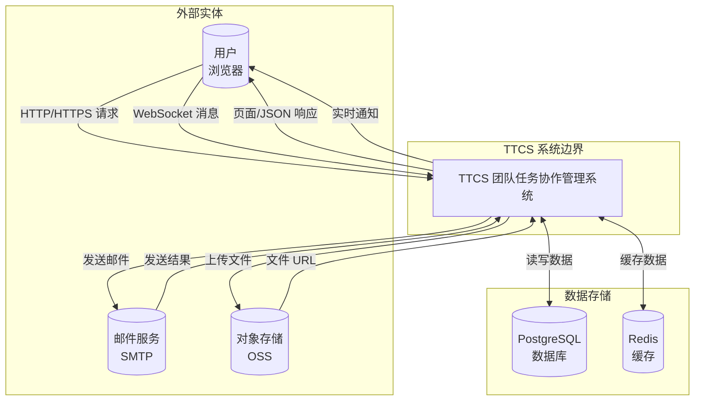

### 2.3 外部实体说明

| 实体编号 | 实体名称 | 类型 | 输入数据流 | 输出数据流 | 说明 |
|---------|---------|------|-----------|-----------|------|
| EXT-01 | 用户浏览器 | 外部系统 | 用户操作请求、表单数据、文件上传 | 页面响应、JSON 数据、WebSocket 推送 | 用户访问系统的主要入口，支持 Chrome、Firefox、Safari、Edge 等现代浏览器 |
| EXT-02 | 邮件服务 | 外部系统 | 邮件发送请求（注册验证、密码找回、通知邮件） | 发送结果状态 | 第三方 SMTP 服务，推荐使用 SendGrid 或阿里云邮件推送 |
| EXT-03 | 对象存储 | 外部系统 | 文件上传请求（头像、附件） | 文件访问 URL | 支持阿里云 OSS、腾讯云 COS 等云存储服务 |

### 2.4 主要数据流汇总

| 数据流编号 | 数据流名称 | 源 | 目的 | 数据内容 | 触发条件 |
|-----------|-----------|-----|------|---------|---------|
| DFD-TOP-01 | 用户操作请求 | 用户浏览器 | TTCS 系统 | HTTP 请求、表单数据、JSON | 用户操作 |
| DFD-TOP-02 | 页面/数据响应 | TTCS 系统 | 用户浏览器 | HTML 页面、JSON 数据 | 请求处理完成 |
| DFD-TOP-03 | 实时通知推送 | TTCS 系统 | 用户浏览器 | WebSocket 消息 | 通知事件触发 |
| DFD-TOP-04 | 邮件发送 | TTCS 系统 | 邮件服务 | 邮件内容、收件人 | 验证/通知需求 |
| DFD-TOP-05 | 文件上传 | TTCS 系统 | 对象存储 | 二进制文件数据 | 用户上传附件 |

---

## 3. 0 层数据流图

### 3.1 用户与团队管理流程

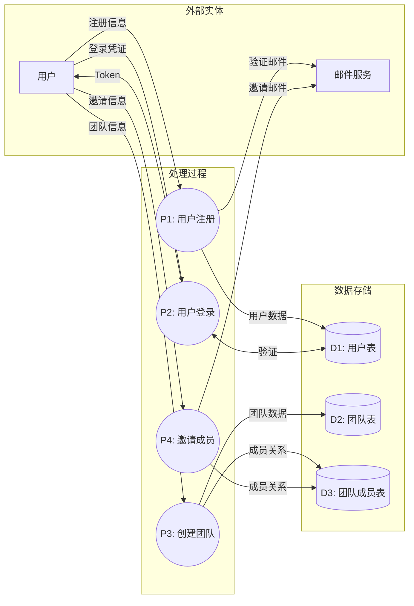

**流程说明：**

| 步骤 | 处理过程 | 输入 | 输出 | 涉及用例 |
|------|---------|------|------|---------|
| 1 | P1: 用户注册 | 邮箱、密码、姓名 | 验证邮件、用户记录 | UC-01 |
| 2 | P2: 用户登录 | 邮箱、密码 | JWT Token | UC-02 |
| 3 | P3: 创建团队 | 团队名称、描述 | 团队记录 | UC-04 |
| 4 | P4: 邀请成员 | 被邀请人邮箱、角色 | 邀请邮件 | UC-05 |

---

### 3.2 项目管理流程

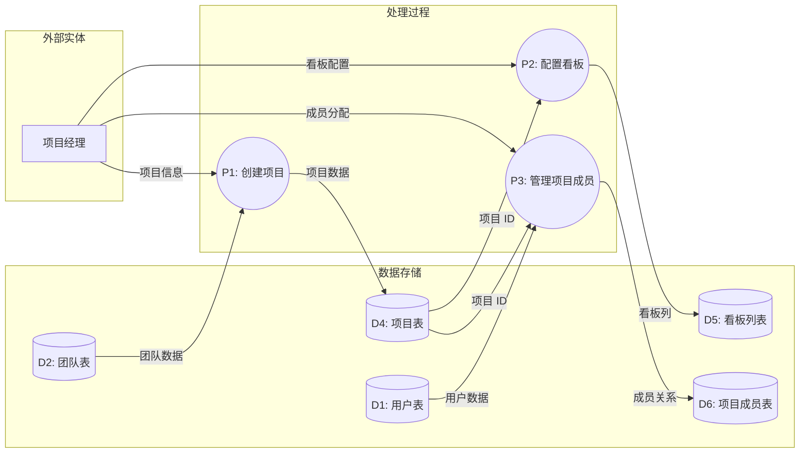

**流程说明：**

| 步骤 | 处理过程 | 输入 | 输出 | 涉及用例 |
|------|---------|------|------|---------|
| 1 | P1: 创建项目 | 项目名称、描述、日期 | 项目记录 | UC-07 |
| 2 | P2: 配置看板 | 列名称、颜色、顺序 | 看板列配置 | UC-08 |
| 3 | P3: 管理项目成员 | 成员 ID、项目角色 | 项目成员关系 | UC-09 |

---

### 3.3 任务全生命周期流程 ⭐核心流程

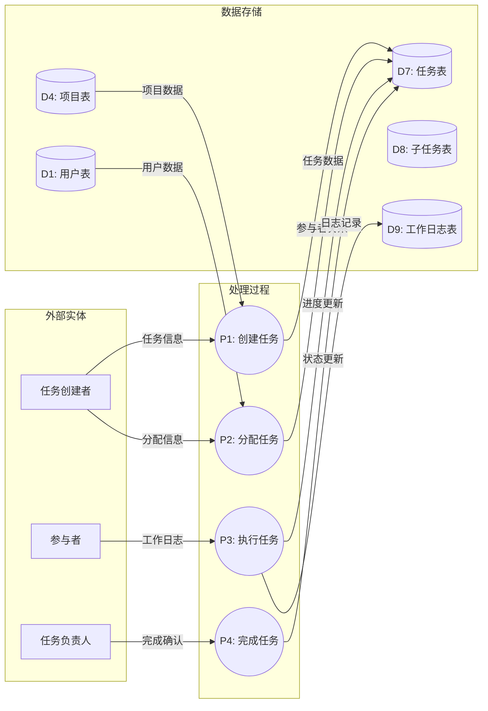

**流程说明：**

| 步骤 | 处理过程 | 输入 | 输出 | 涉及用例 |
|------|---------|------|------|---------|
| 1 | P1: 创建任务 | 任务标题、描述、优先级 | 任务记录 | UC-10 |
| 2 | P2: 分配任务 | 负责人、参与者 | 参与者关系更新 | UC-15 |
| 3 | P3: 执行任务 | 工作日志、进度更新 | 日志记录、进度更新 | UC-16 |
| 4 | P4: 完成任务 | 完成确认 | 状态更新为已完成 | UC-13 |

---

### 3.4 协作沟通流程

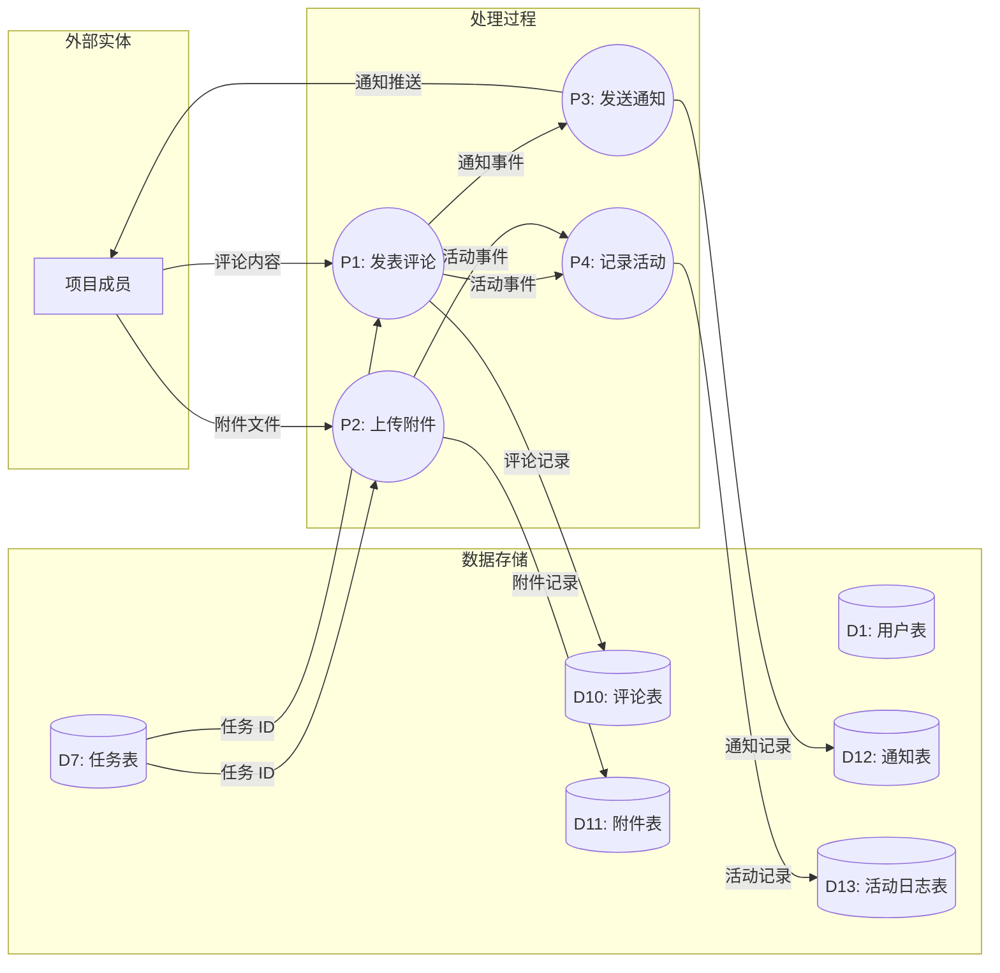

**流程说明：**

| 步骤 | 处理过程 | 输入 | 输出 | 涉及用例 |
|------|---------|------|------|---------|
| 1 | P1: 发表评论 | 评论内容、@提及 | 评论记录、通知 | UC-17 |
| 2 | P2: 上传附件 | 文件数据 | 附件记录、URL | UC-20 |
| 3 | P3: 发送通知 | 通知事件、接收人 | WebSocket 推送 | UC-19 |
| 4 | P4: 记录活动 | 活动事件 | 活动日志 | UC-18 |

---

### 3.5 报表统计流程

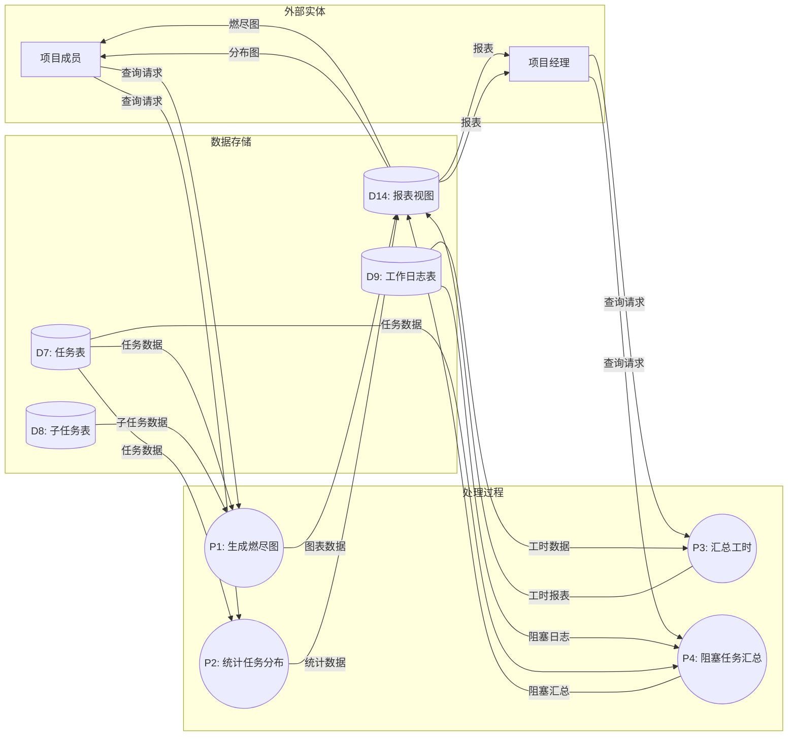

**流程说明：**

| 步骤 | 处理过程 | 输入 | 输出 | 涉及用例 |
|------|---------|------|------|---------|
| 1 | P1: 生成燃尽图 | 时间范围、项目 ID | 燃尽图数据 | UC-21 |
| 2 | P2: 统计任务分布 | 统计维度、项目 ID | 统计数据 | UC-22 |
| 3 | P3: 汇总工时 | 时间范围、成员 ID | 工时报表 | UC-23 |
| 4 | P4: 阻塞任务汇总 | 项目 ID、时间范围 | 阻塞列表 | UC-24 |

---

## 4. 1 层数据流图

### 4.1 任务创建与分配流程

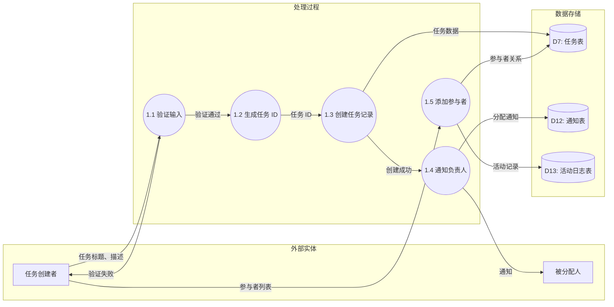

**详细处理说明：**

| 子过程 | 处理逻辑 | 业务规则 | 异常处理 |
|--------|---------|---------|---------|
| 1.1 验证输入 | 检查标题非空、长度 2-200 字符、描述≤10000 字符 | BR-TASK-001, BR-TASK-002 | 返回字段错误提示 |
| 1.2 生成任务 ID | 使用 UUID v4 生成唯一标识 | - | 重试生成（极低概率冲突） |
| 1.3 创建任务记录 | 插入 tasks 表，状态默认为 TODO | - | 数据库事务回滚 |
| 1.4 通知负责人 | 创建通知记录，WebSocket 推送 | BR-COMM-004 | 通知失败记录日志 |
| 1.5 添加参与者 | 验证人数≤5，写入参与者关系 | BR-TASK-022 | 超出限制返回错误 |

**涉及用例：** UC-10（创建任务）、UC-15（管理任务参与者）

---

### 4.2 任务执行与工作日志流程

```mermaid
graph LR
    subgraph 外部实体
        Member[任务参与者]
        Owner[任务负责人]
    end

    subgraph 处理过程
        P2_1((2.1 验证权限))
        P2_2((2.2 验证输入数据))
        P2_3((2.3 创建工作日志))
        P2_4((2.4 更新任务进度))
        P2_5((2.5 检查阻塞状态))
    end

    subgraph 数据存储
        D7[(D7: 任务表)]
        D8[(D8: 子任务表)]
        D9[(D9: 工作日志表)]
    end

    Member -->|记录请求 | P2_1
    D7 -->|任务数据 | P2_1
    P2_1 -->|权限通过 | P2_2
    P2_1 -->|权限拒绝 | Member

    Member -->|工时、日期、内容 | P2_2
    P2_2 -->|验证通过 | P2_3
    P2_2 -->|验证失败 | Member

    P2_3 -->|日志记录 | D9
    P2_3 -->|创建成功 | P2_4

    D8 -->|子任务数据 | P2_4
    P2_4 -->|进度更新 | D7

    P2_4 -->|进度数据 | P2_5
    P2_5 -->|is_blocked=true| 2.6 阻塞处理
    P2_5 -->|is_blocked=false| Owner
```

**详细处理说明：**

| 子过程 | 处理逻辑 | 业务规则 | 异常处理 |
|--------|---------|---------|---------|
| 2.1 验证权限 | 检查用户是否为任务参与者 | BR-TASK-024 | 返回 403 权限错误 |
| 2.2 验证输入数据 | 工时 0.5-24 小时、日期≤30 天、描述≤5000 字符 | BR-TASK-015, BR-TASK-016, BR-TASK-018 | 返回字段错误提示 |
| 2.3 创建工作日志 | 插入 work_logs 表，解析 Markdown | BR-TASK-018 | 数据库事务回滚 |
| 2.4 更新任务进度 | 计算子任务完成度，更新 tasks.progress | BR-TASK-008 | 并发锁控制 |
| 2.5 检查阻塞状态 | 读取 is_blocked 字段 | BR-TASK-019 | - |

**涉及用例：** UC-16（记录工作日志）

---

### 4.3 阻塞问题处理流程

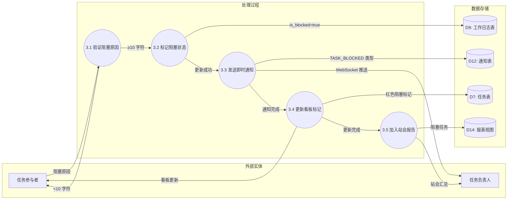

**详细处理说明：**

| 子过程 | 处理逻辑 | 业务规则 | 异常处理 |
|--------|---------|---------|---------|
| 3.1 验证阻塞原因 | 检查原因描述≥10 字符 | BR-TASK-019 | 返回"请填写详细阻塞原因" |
| 3.2 标记阻塞状态 | 更新 work_logs.is_blocked=true | BR-TASK-019 | 数据库事务回滚 |
| 3.3 发送即时通知 | 创建 TASK_BLOCKED 类型通知，WebSocket 推送 | BR-COMM-004 | 通知失败记录日志 |
| 3.4 更新看板标记 | 更新 tasks.blocked=true，前端显示红色标记 | - | - |
| 3.5 加入站会报告 | 更新报表视图，按阻塞时长排序 | BR-REPORT-004 | - |

**阻塞通知三重保障机制：**

```
┌─────────────────────────────────────────────────────┐
│                  阻塞上报触发                        │
└───────────────────┬─────────────────────────────────┘
                    │
        ┌───────────┼───────────┐
        │           │           │
        ▼           ▼           ▼
   ┌────────┐  ┌────────┐  ┌────────┐
   │即时通知 │  │看板标记 │  │站会报告 │
   │ 给 Owner│  │ 红色  │  │ 汇总  │
   └───┬────┘  └───┬────┘  └───┬────┘
       │           │           │
       ▼           ▼           ▼
   ┌────────┐  ┌────────┐  ┌────────┐
   │确保及时│  │确保可见│  │确保跟踪│
   │ 响应  │  │ 发现  │  │ 解决  │
   └────────┘  └────────┘  └────────┘
```

**涉及用例：** UC-16（记录工作日志 - 备选流程）、UC-19（接收通知）、UC-24（查看阻塞任务汇总）

---

### 4.4 任务状态流转流程

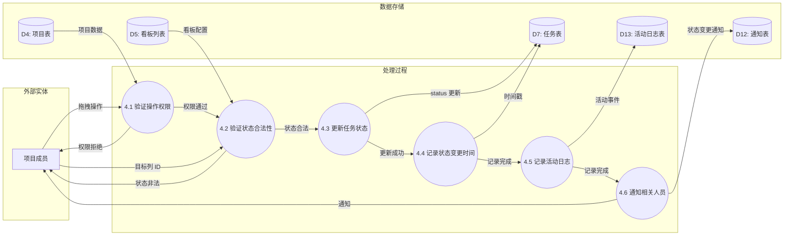

**详细处理说明：**

| 子过程 | 处理逻辑 | 业务规则 | 异常处理 |
|--------|---------|---------|---------|
| 4.1 验证操作权限 | 检查用户是否为项目成员 | - | 返回 403 权限错误 |
| 4.2 验证状态合法性 | 检查目标列是否存在、状态流转是否允许 | - | 返回"无效的状态变更" |
| 4.3 更新任务状态 | 更新 tasks.status 和 tasks.column_id | - | 数据库事务回滚 |
| 4.4 记录状态变更时间 | 更新 tasks.status_changed_at | - | - |
| 4.5 记录活动日志 | 插入 activity_logs 表，类型 STATUS_CHANGE | - | - |
| 4.6 通知相关人员 | 通知任务 Owner 和参与者 | BR-COMM-004 | 通知失败记录日志 |

**状态流转规则：**

```
默认状态机：

┌─────────┐      ┌─────────┐      ┌─────────┐      ┌─────────┐
│  待办   │ ────▶│ 进行中  │ ────▶│ 审查中  │ ────▶│ 已完成  │
│  TODO   │      │IN_PROGRESS│    │ REVIEW  │      │  DONE   │
└─────────┘      └────┬────┘      └────┬────┘      └─────────┘
                      │                 │
                      └─────────────────┘
                           可回退
```

**涉及用例：** UC-13（流转任务状态）、UC-18（查看活动动态）

---

### 4.5 通知推送流程

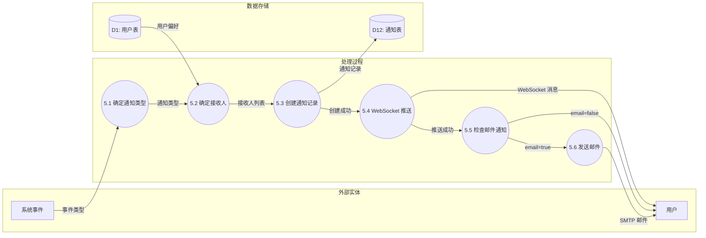

**详细处理说明：**

| 子过程 | 处理逻辑 | 业务规则 | 异常处理 |
|--------|---------|---------|---------|
| 5.1 确定通知类型 | 根据事件类型映射通知类型 | - | - |
| 5.2 确定接收人 | 根据业务规则确定接收人，检查用户通知偏好 | BR-COMM-004 | - |
| 5.3 创建通知记录 | 插入 notifications 表 | - | 数据库事务回滚 |
| 5.4 WebSocket 推送 | 通过 Socket.io 推送给在线用户 | - | 推送失败标记为未读 |
| 5.5 检查邮件通知 | 检查用户是否开启邮件通知 | BR-COMM-004 | - |
| 5.6 发送邮件 | 调用 SMTP 服务发送邮件 | - | 邮件失败记录日志 |

**通知类型映射：**

| 事件类型 | 通知类型 | 触发场景 |
|---------|---------|---------|
| TASK_ASSIGNED | 任务分配 | 用户被分配为任务负责人或参与者 |
| TASK_MENTIONED | @提及 | 任务评论中被@ |
| TASK_COMMENT | 评论回复 | 任务下有新的评论 |
| TASK_BLOCKED | 任务阻塞 | 任务工作日志标记阻塞 |
| TASK_DUE_SOON | 截止提醒 | 任务截止时间前 1 天/当天 |
| PROJECT_INVITE | 项目邀请 | 用户被邀请加入项目 |

**涉及用例：** UC-19（接收通知）

---

## 5. 数据存储设计

### 5.1 核心数据实体关系图 (ERD)

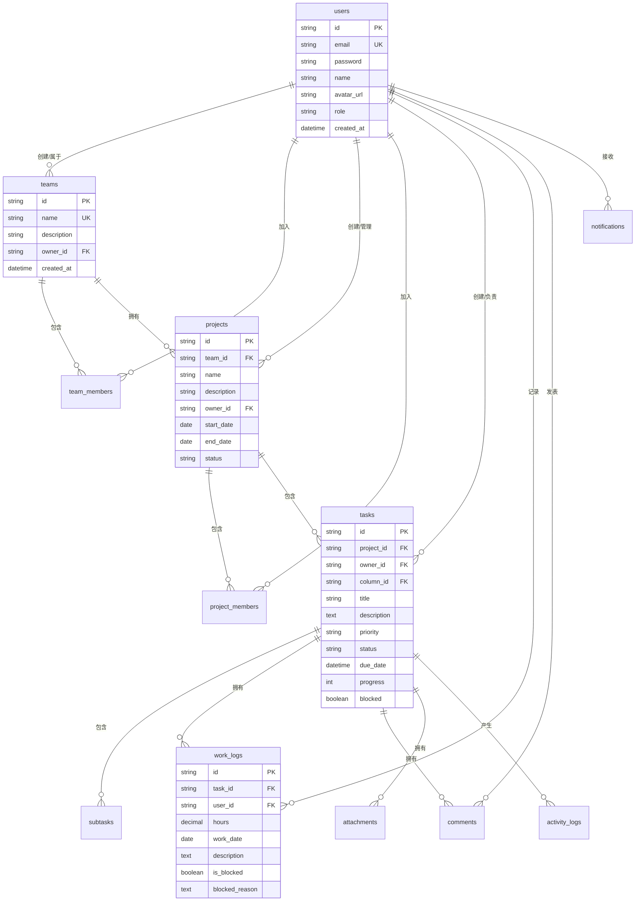

### 5.2 数据存储说明

| 数据存储编号 | 数据存储名称 | 对应表 | 主要字段 | 数据量预估 | 保留策略 |
|------------|------------|--------|---------|-----------|---------|
| D1 | 用户表 | users | id, email, password, name, role | 1,000+ | 账号注销后 30 天匿名化 |
| D2 | 团队表 | teams | id, name, owner_id, created_at | 100+ | 永久保留 |
| D3 | 团队成员表 | team_members | team_id, user_id, role | 5,000+ | 随团队解散清理 |
| D4 | 项目表 | projects | id, team_id, name, status | 500+ | 项目删除后 90 天软删除 |
| D5 | 看板列表 | board_columns | id, project_id, name, color, sort | 2,000+ | 随项目删除清理 |
| D6 | 项目成员表 | project_members | project_id, user_id, role | 2,000+ | 随项目删除清理 |
| D7 | 任务表 | tasks | id, project_id, owner_id, status, progress | 10,000+ | 软删除，30 天后可恢复 |
| D8 | 子任务表 | subtasks | id, parent_task_id, title, completed | 30,000+ | 随父任务删除清理 |
| D9 | 工作日志表 | work_logs | id, task_id, user_id, hours, is_blocked | 100,000+ | 保留 180 天 |
| D10 | 评论表 | comments | id, task_id, user_id, content | 50,000+ | 软删除 |
| D11 | 附件表 | attachments | id, task_id, file_url, file_size | 20,000+ | 关联删除后 30 天清理 |
| D12 | 通知表 | notifications | id, user_id, type, is_read | 500,000+ | 保留 90 天 |
| D13 | 活动日志表 | activity_logs | id, project_id, type, description | 200,000+ | 保留 180 天 |
| D14 | 报表视图 | (物化视图) | 聚合统计数据 | - | 实时刷新 |

### 5.3 数据生命周期

```
数据创建 → 数据使用 → 数据归档 → 数据清理

┌─────────────────────────────────────────────────────────────┐
│                     数据生命周期管理                         │
├─────────────────────────────────────────────────────────────┤
│                                                             │
│  用户数据：创建 → 活跃使用 → 账号注销 → 30 天匿名化          │
│                                                             │
│  任务数据：创建 → 执行中 → 已完成 → 项目删除 → 90 天软删除   │
│                                                             │
│  工作日志：创建 → 24 小时可编辑 → 只读 → 180 天自动清理      │
│                                                             │
│  通知数据：创建 → 已读 → 7 天后可清理 → 90 天自动清理        │
│                                                             │
│  活动日志：创建 → 查询使用 → 180 天自动清理                 │
│                                                             │
└─────────────────────────────────────────────────────────────┘
```

**数据清理策略：**

| 数据类型 | 清理触发条件 | 清理方式 | 责任人 |
|---------|------------|---------|--------|
| 用户数据 | 账号注销后 30 天 | 匿名化处理 | 系统自动 |
| 任务数据 | 项目删除后 90 天 | 物理删除 | 系统自动 |
| 工作日志 | 创建后 180 天 | 物理删除 | 系统自动 |
| 通知记录 | 创建后 90 天 | 物理删除 | 系统自动 |
| 活动日志 | 创建后 180 天 | 物理删除 | 系统自动 |
| 附件文件 | 关联删除后 30 天 | 物理删除 | 系统自动 |

---

## 6. 用例映射索引

### 6.1 数据流 - 用例对应表

| 数据流编号 | 数据流名称 | 主作用例 | 辅作用例 | 涉及模块 | 数据流图章节 |
|-----------|-----------|---------|---------|---------|-------------|
| DFD-3.1 | 用户与团队管理 | UC-01, UC-02 | UC-03, UC-04, UC-05, UC-06 | 用户管理、团队管理 | 3.1 |
| DFD-3.2 | 项目管理 | UC-07, UC-08 | UC-09 | 项目管理 | 3.2 |
| DFD-3.3 | 任务全生命周期 | UC-10, UC-13 | UC-11, UC-12, UC-14 | 任务管理 | 3.3 |
| DFD-3.4 | 协作沟通 | UC-17, UC-18 | UC-19, UC-20 | 协作沟通 | 3.4 |
| DFD-3.5 | 报表统计 | UC-21, UC-22 | UC-23, UC-24, UC-25 | 报表统计 | 3.5 |
| DFD-4.1 | 任务创建与分配 | UC-10 | UC-15 | 任务管理 | 4.1 |
| DFD-4.2 | 任务执行与工作日志 | UC-16 | UC-15 | 任务管理 | 4.2 |
| DFD-4.3 | 阻塞问题处理 | UC-16 | UC-19, UC-24 | 任务管理、报表统计 | 4.3 |
| DFD-4.4 | 任务状态流转 | UC-13 | UC-18 | 任务管理 | 4.4 |
| DFD-4.5 | 通知推送 | UC-19 | UC-17 | 协作沟通 | 4.5 |

### 6.2 业务流程用例地图

```
用户旅程：从注册到任务完成

          用户注册        用户登录        创建团队
             │              │              │
             ▼              ▼              ▼
         ┌──────────────────────────────────────┐
         │         UC-01   UC-02   UC-04        │
         │         UC-03   UC-05   UC-06        │
         │           用户与团队管理流程          │
         │              DFD-3.1                │
         └──────────────────────────────────────┘
                          │
                          ▼
         ┌──────────────────────────────────────┐
         │         UC-07   UC-08   UC-09        │
         │           项目管理流程               │
         │              DFD-3.2                │
         └──────────────────────────────────────┘
                          │
                          ▼
         ┌──────────────────────────────────────┐
         │    UC-10  创建任务                   │
         │    UC-15  管理参与者                 │
         │         任务创建与分配流程            │
         │              DFD-4.1                │
         └──────────────────────────────────────┘
                          │
                          ▼
         ┌──────────────────────────────────────┐
         │    UC-16  记录工作日志               │
         │    UC-13  流转任务状态               │
         │         任务执行流程                 │
         │           DFD-4.2                   │
         └──────────────────────────────────────┘
                          │
              ┌───────────┴───────────┐
              │                       │
              ▼                       ▼
    ┌──────────────────┐    ┌──────────────────┐
    │  正常执行        │    │  遇到阻塞        │
    │                  │    │                  │
    │  DFD-4.4         │    │  DFD-4.3         │
    │  状态流转        │    │  阻塞处理        │
    │                  │    │                  │
    │                  │    │  UC-19  接收通知  │
    │                  │    │  UC-24  阻塞汇总  │
    └────────┬─────────┘    └────────┬─────────┘
              │                       │
              └───────────┬───────────┘
                          │
                          ▼
         ┌──────────────────────────────────────┐
         │    UC-17  发表评论                   │
         │    UC-18  查看活动                   │
         │    UC-20  上传附件                   │
         │         协作沟通流程                 │
         │              DFD-3.4                │
         └──────────────────────────────────────┘
                          │
                          ▼
         ┌──────────────────────────────────────┐
         │    UC-21  燃尽图                     │
         │    UC-22  任务统计                   │
         │    UC-24  阻塞汇总                   │
         │         报表统计流程                 │
         │              DFD-3.5                │
         └──────────────────────────────────────┘
```

### 6.3 用例优先级与数据流复杂度矩阵

| 用例 ID | 用例名称 | 优先级 | 涉及数据流数量 | 数据流复杂度 | 实现难度 |
|--------|---------|--------|---------------|-------------|---------|
| UC-01 | 用户注册 | 高 | 3 | 低 | 低 |
| UC-02 | 用户登录 | 高 | 2 | 低 | 低 |
| UC-04 | 创建团队 | 高 | 3 | 低 | 低 |
| UC-07 | 创建项目 | 高 | 3 | 低 | 低 |
| UC-10 | 创建任务 | 高 | 5 | 中 | 中 |
| UC-13 | 流转任务状态 | 高 | 4 | 中 | 低 |
| UC-15 | 管理任务参与者 | 高 | 3 | 中 | 中 |
| UC-16 | 记录工作日志 | 高 | 6 | 高 | 高 |
| UC-17 | 发表评论 | 高 | 4 | 中 | 低 |
| UC-19 | 接收通知 | 高 | 5 | 高 | 中 |
| UC-21 | 查看燃尽图 | 高 | 3 | 中 | 中 |
| UC-24 | 查看阻塞汇总 | 高 | 4 | 中 | 低 |

---

## 7. 附录

### 附录 A：图例说明

**数据流图符号：**

| 符号 | 名称 | 说明 | 示例 |
|------|------|------|------|
| ┌─────┐ | 矩形 | 外部实体（数据源/终点） | 用户、邮件服务 |
| ○ | 圆形 | 处理过程（数据变换） | 创建任务、发送通知 |
| ══ | 开口矩形 | 数据存储 | 数据库表 |
| → | 箭头 | 数据流（流动方向） | 请求、响应 |

**Mermaid 图例：**

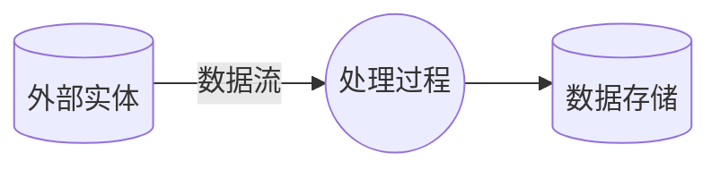

### 附录 B：术语表

| 术语 | 英文 | 定义 |
|------|------|------|
| 数据流图 | Data Flow Diagram (DFD) | 描述系统数据流动、处理和存储的图形化技术 |
| 外部实体 | External Entity | 系统外部的数据源或数据终点 |
| 处理过程 | Process | 对数据进行变换或处理的逻辑单元 |
| 数据存储 | Data Store | 数据的存储位置，如数据库表、文件等 |
| 数据流 | Data Flow | 数据在系统中的流动路径和方向 |
| 顶层图 | Context Diagram | 0 层 DFD，展示系统与外部实体的关系 |
| 0 层 DFD | Level-0 DFD | 展示系统主要处理过程和数据流 |
| 1 层 DFD | Level-1 DFD | 对 0 层 DFD 的细化，展示子过程 |
| 实体关系图 | Entity Relationship Diagram (ERD) | 描述数据实体及其关系的图形 |
| WebSocket | WebSocket | 网络通信协议，提供全双工通信 |
| JWT | JSON Web Token | 一种开放标准 (RFC 7519)，用于安全传输 JSON 对象 |

### 附录 C：参考文献

| 编号 | 文献名称 | 来源 |
|------|---------|------|
| [1] | 软件需求规格说明书 SRS-2026-001 | 本项目 |
| [2] | 用例文档 UC-2026-001 | 本项目 |
| [3] | 数据库设计文档 DBD-2026-001 | 本项目 |
| [4] | Structured Analysis and System Specification, Yourdon & Constantine | 经典软件工程著作 |

---

**文档控制**

| 编制 | 审核 | 批准 |
|------|------|------|
| 日期： | 日期： | 日期： |

---

*本文档与《用例文档 UC-2026-001》配合使用，共同描述系统功能需求。*
