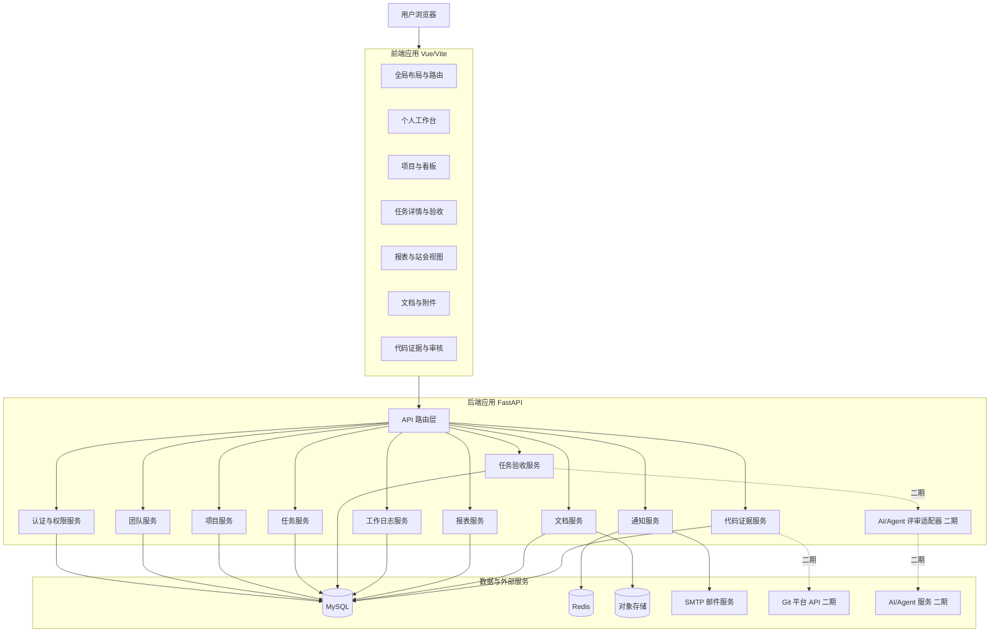
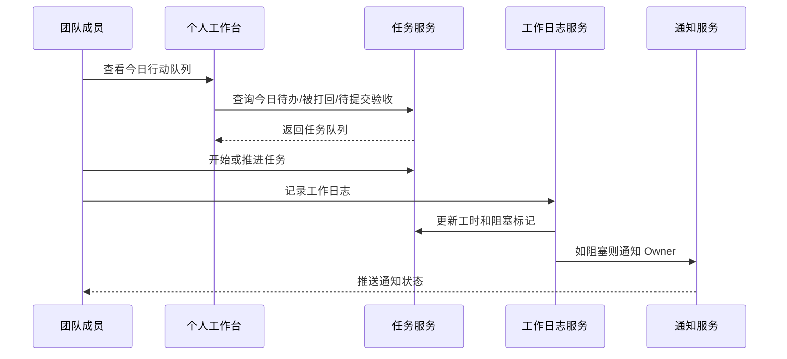
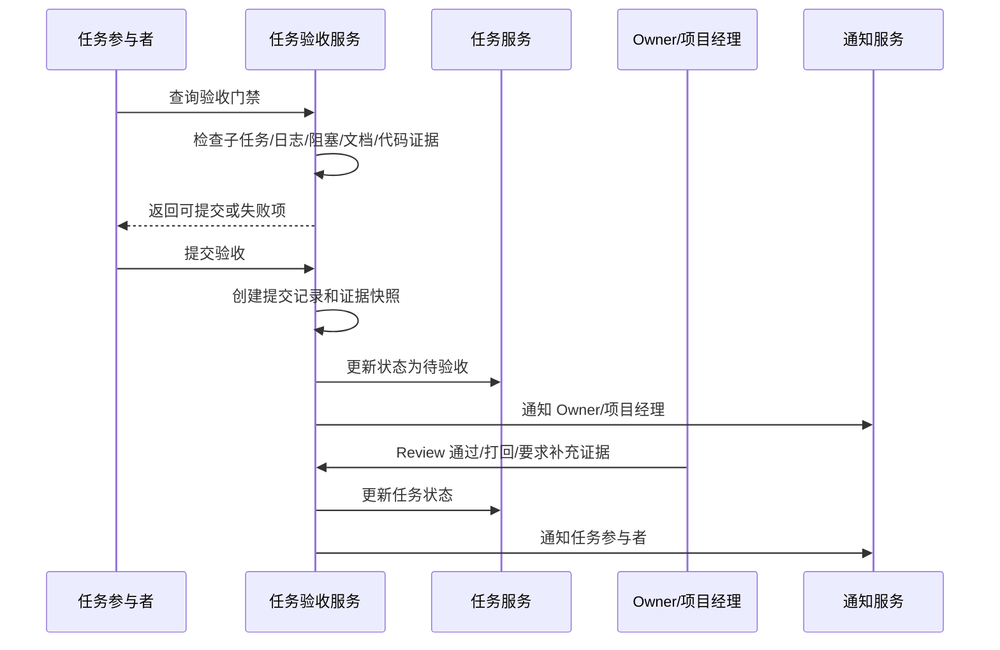
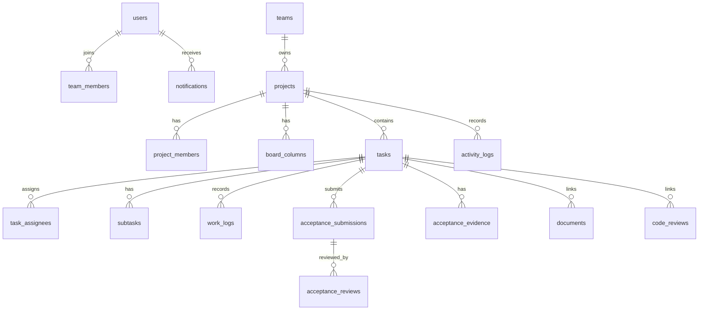

# 概要设计说明书

**文档编号：** HLD-2026-001  
**版本号：** V1.0  
**密级：** 内部公开  
**编制日期：** 2026-05-17  
**关联需求：** `01-requirements/02-srs.md` V2.4  
**关联设计：** `02-design/01-task-acceptance-design.md`

---

## 修订历史

| 版本 | 日期 | 修改说明 |
|------|------|---------|
| V1.0 | 2026-05-17 | 初始版本，基于 SRS V2.4 和任务验收设计编制概要设计 |

---

## 1. 引言

### 1.1 目的

本文档描述 TTCS（Team Task Collaboration System，团队任务协作管理系统）的概要设计，明确系统架构、模块划分、核心流程、数据边界、接口边界和一期/二期架构取舍。

本文档用于指导后续详细设计、数据库设计、API 设计、前后端开发和测试设计。

### 1.2 设计范围

本概要设计覆盖 SRS V2.4 定义的一期 MVP 范围，并为二期扩展预留架构边界。

一期 MVP 核心目标：

- 完成用户、团队、项目、任务、工作日志、通知、报表、文档证据、代码证据的基础闭环。
- 以“每日站会 + 个人执行 + 任务验收”为主线，证明 TTCS 不是普通任务看板。
- 任务完成必须经过证据门禁和 Owner/项目经理人工 Review。

二期扩展方向：

- 日历视图、成员主页、文档归档。
- 真实 Git Webhook 和代码数据同步。
- AI/Agent 辅助代码评审。
- 项目级验收模板、任务类型自定义、多角色会签。

### 1.3 设计依据

| 编号 | 文档 | 说明 |
|------|------|------|
| REF-01 | `01-requirements/02-srs.md` | SRS V2.4，当前需求基线 |
| REF-02 | `02-design/01-task-acceptance-design.md` | 任务验收与完成确认设计 |
| REF-03 | `01-requirements/03-use-case.md` | 用例与业务流程参考 |
| REF-04 | `01-requirements/04-data-flow.md` | 数据流与处理过程参考 |
| REF-05 | `01-requirements/04-prototype.md` | 页面结构与交互参考 |

## 2. 总体架构

### 2.1 架构风格

TTCS 采用前后端分离的 B/S 架构：

- 前端：Vue 3 + TypeScript + Vite + Pinia + Vue Router + Ant Design Vue。
- 后端：Python 3.10+ + FastAPI + SQLAlchemy。
- 数据库：MySQL 8.0+。
- 缓存与实时状态：Redis 7+。
- 实时通信：WebSocket。
- 文件存储：对象存储服务，一期可使用本地模拟或兼容对象存储接口。
- Git 集成：一期支持手工或模拟代码证据，二期接入真实 Git 平台 API/Webhook。

### 2.2 逻辑架构



### 2.3 部署架构

一期建议采用单体后端 + 前端静态部署 + MySQL + Redis 的轻量部署方式。

```text
Nginx
  ├─ 前端静态资源 frontend/dist
  └─ 反向代理 /api、/ws 到 FastAPI

FastAPI 应用
  ├─ REST API
  ├─ WebSocket
  ├─ 后台任务
  └─ 文件上传适配

MySQL 8.0
Redis 7
对象存储或本地兼容存储
```

一期不拆微服务。原因：

- 当前目标是项目 Demo 和 MVP 闭环，不是高并发平台化交付。
- 模块之间数据一致性强，尤其是任务、工作日志、验收、通知。
- 单体后端更容易保证事务边界和开发速度。

## 3. 分层设计

### 3.1 前端分层

| 层 | 职责 | 典型内容 |
|----|------|---------|
| 路由层 | 页面路由、权限守卫 | 登录页、工作台、项目、任务、报表 |
| 布局层 | 顶部导航、侧边栏、主内容容器 | AppLayout、ProjectLayout |
| 视图层 | 页面级业务编排 | WorkspaceView、BoardView、TaskDetailView |
| 组件层 | 可复用 UI 组件 | TaskCard、AcceptancePanel、WorkLogList |
| 状态层 | 用户、项目、任务、通知状态 | Pinia stores |
| API 层 | Axios 封装、错误处理 | authApi、taskApi、acceptanceApi |

### 3.2 后端分层

| 层 | 职责 |
|----|------|
| API 路由层 | 接收请求、认证上下文、参数校验、响应组装 |
| Schema 层 | Pydantic 请求/响应模型 |
| Service 层 | 业务规则、状态机、事务编排 |
| Repository 层 | 数据查询与持久化 |
| Model 层 | SQLAlchemy ORM 模型 |
| Integration 层 | 邮件、对象存储、Git API、AI/Agent 适配 |
| Background 层 | 通知发送、缓存刷新、异步同步任务 |

### 3.3 事务边界

下列操作必须在数据库事务内完成：

- 创建任务及初始参与者。
- 任务状态流转。
- 工作日志创建及阻塞标记更新。
- 提交任务验收。
- Review 通过、打回、要求补充证据。
- 文档上传元数据与验收证据关联。
- 代码证据与任务关联。

通知推送不应阻塞主事务。主事务提交成功后，再创建通知或推送 WebSocket；推送失败时保留未读通知记录。

## 4. 模块设计

### 4.1 模块总览

| 模块 | 一期/二期 | 核心职责 |
|------|-----------|---------|
| 用户认证模块 | 一期 | 注册、登录、JWT、当前用户上下文 |
| 团队管理模块 | 一期 | 团队、成员、邀请、团队角色 |
| 项目管理模块 | 一期 | 项目、项目成员、默认看板列 |
| 任务管理模块 | 一期 | 任务、参与者、子任务、依赖、状态流转 |
| 任务验收模块 | 一期核心 | 门禁检查、提交验收、Review、证据快照 |
| 工作日志模块 | 一期 | 工时、工作内容、阻塞原因、日志权限 |
| 通知与活动模块 | 一期 | 活动记录、通知记录、WebSocket 推送 |
| 个人工作台模块 | 一期核心 | 今日行动队列、项目进度、最近活动 |
| 报表统计模块 | 一期 | 项目进度、阻塞报告、验收统计 |
| 文档管理模块 | 一期 | 文件元数据、上传下载、交付物证据 |
| 代码证据模块 | 一期 | 手工/模拟 Commit、PR、代码审核证据 |
| 代码集成模块 | 二期 | Git API/Webhook、提交自动同步 |
| AI/Agent 评审模块 | 二期 | 代码变更摘要、风险、测试建议 |
| 日历视图模块 | 二期 | 日/周/月视图、外部日历同步 |
| 成员主页模块 | 二期 | 成员统计、项目和工作日志时间线 |

### 4.2 用户认证模块

职责：

- 用户注册、登录、密码找回。
- JWT 生成与校验。
- 当前用户上下文解析。
- 密码加密存储。

关键设计：

- API 使用 Bearer Token。
- 密码使用 bcrypt。
- 后端依赖 `current_user` 上下文进行权限判断。

### 4.3 团队与项目模块

职责：

- 团队创建、成员邀请、成员角色管理。
- 项目创建、项目成员管理。
- 项目默认看板列初始化。

一期默认看板列：

```text
待办 / 进行中 / 待验收 / 打回修改 / 已完成
```

关键设计：

- 团队角色和项目角色分开。
- 任务操作权限优先基于项目成员关系判断。
- 项目经理拥有任务 Review 权限。

### 4.4 任务管理模块

职责：

- 任务创建、编辑、软删除。
- 任务参与者管理。
- 子任务管理。
- 任务依赖管理。
- 状态流转。

关键设计：

- `owner_id` 表示任务责任人。
- `task_assignees` 表示任务参与者，最多 5 人。
- 任务类型包括 `GENERAL`、`DOCUMENT`、`CODE`。
- 阻塞作为任务风险标记，不作为主状态。

状态机：

```text
待办 -> 进行中 -> 待验收 -> 已完成 -> 已关闭
                  ^      |
                  |      v
               打回修改 <-
```

### 4.5 任务验收模块

任务验收模块是一期开闭环的核心模块。

职责：

- 按任务类型执行验收门禁检查。
- 创建验收提交记录。
- 固化验收证据快照。
- 执行 Owner/项目经理 Review。
- 处理通过、打回、要求补充证据。
- 为工作台和报表提供待验收、被打回、验收统计数据。

核心服务：

| 服务 | 职责 |
|------|------|
| AcceptanceGateService | 执行普通/文档/代码任务门禁检查 |
| AcceptanceSubmissionService | 创建提交记录和证据快照 |
| AcceptanceReviewService | 执行通过、打回、补充证据 |
| AcceptanceEvidenceService | 汇总子任务、日志、文档、代码审核等证据 |

门禁检查结果示例：

```json
{
  "can_submit": false,
  "failed_checks": [
    {
      "code": "WORK_LOG_REQUIRED",
      "message": "至少需要 1 条有效工作日志"
    }
  ]
}
```

设计约束：

- 任务参与者不能直接将任务置为已完成。
- Owner 和项目经理拥有最终 Review 权限。
- AI/Agent 评审仅作为二期辅助证据，不拥有最终完成权。

### 4.6 工作日志与阻塞模块

职责：

- 记录工时、工作内容、工作类型。
- 标记阻塞和阻塞原因。
- 支持工作日志可见性规则。
- 为验收门禁和报表提供证据。

关键设计：

- 工作日志是普通任务和代码任务的基础验收证据。
- 未解除阻塞会阻止提交验收。
- 阻塞任务进入每日站会报告。

### 4.7 个人工作台模块

职责：

- 聚合当前用户需要行动的任务队列。
- 展示项目进度和最近活动。
- 作为每日执行入口。

一期工作台队列：

- 今日待办。
- 待写工作日志。
- 阻塞中任务。
- 待提交验收。
- 待我验收。
- 被打回任务。

设计要点：

- 工作台不是单纯统计页，而是行动队列。
- 待我验收仅显示当前用户为 Owner 或项目经理的待验收任务。
- 被打回任务必须显示最近打回原因。

### 4.8 通知与活动模块

职责：

- 记录活动动态。
- 创建通知记录。
- WebSocket 实时推送。
- 邮件通知扩展。

一期通知事件：

- 任务分配。
- @ 提及。
- 工作日志阻塞。
- 提交验收。
- 验收通过。
- 打回修改。
- 要求补充证据。

设计要点：

- 通知写入与业务事务解耦。
- WebSocket 推送失败不影响主业务。
- 未读通知保存在数据库，可重新拉取。

### 4.9 报表统计模块

职责：

- 项目进度。
- 任务分布。
- 工时统计。
- 阻塞任务报告。
- 任务验收统计。

关键指标：

- 待验收任务数。
- 验收通过率。
- 平均验收时长。
- 打回任务数和打回次数。
- 阻塞任务数和阻塞时长。

### 4.10 文档管理模块

职责：

- 文件上传、下载、软删除。
- 文档元数据管理。
- 文档任务交付物证据关联。

一期设计：

- 支持文档任务把附件作为验收证据。
- 文件内容可以存储到对象存储或本地兼容存储。
- 数据库只保存文件元数据、访问 URL 和权限信息。

### 4.11 代码证据与代码审核模块

一期职责：

- 为代码任务关联 Commit、PR/MR 或代码审核记录。
- 支持手工录入或模拟代码证据。
- 代码审核记录可作为代码任务验收门禁的一部分。

二期职责：

- 接入真实 GitHub/GitLab API。
- 支持 Webhook 自动同步提交、PR/MR、文件变化。
- 支持 AI/Agent 辅助评审。

边界：

- 代码审核通过不等于任务已完成。
- 代码任务仍需经过任务验收 Review。

## 5. 核心业务流程

### 5.1 每日执行闭环



### 5.2 任务验收闭环



### 5.3 阻塞处理闭环

```text
成员记录工作日志并标记阻塞
  -> 系统校验阻塞原因
  -> 任务显示阻塞标记
  -> 通知 Owner/项目经理
  -> 加入站会阻塞报告
  -> 阻塞解除后允许提交验收
```

### 5.4 代码任务证据闭环

一期：

```text
代码任务 -> 手工/模拟关联 Commit 或 PR -> 创建代码审核记录 -> 解决评论 -> 提交任务验收
```

二期：

```text
Git Webhook -> 同步 Commit/PR -> AI/Agent 辅助评审 -> 生成风险和测试建议 -> 作为验收证据
```

## 6. 数据架构

### 6.1 核心实体

| 领域 | 核心实体 |
|------|---------|
| 用户与团队 | users、teams、team_members |
| 项目 | projects、project_members、board_columns |
| 任务 | tasks、task_assignees、subtasks、task_dependencies |
| 工作日志 | work_logs |
| 验收 | acceptance_submissions、acceptance_reviews、acceptance_evidence |
| 文档 | documents、attachments |
| 代码 | repository_bindings、code_commits、code_reviews、code_review_comments |
| 通知活动 | notifications、activity_logs |

### 6.2 数据关系概览



### 6.3 数据一致性策略

- 任务状态和验收提交必须同事务写入。
- 验收 Review 和任务状态更新必须同事务写入。
- 验收证据快照创建后不覆盖，只追加。
- 工作日志、文档、代码审核作为证据时，记录引用和提交时快照。
- 通知可异步补偿，不影响任务主流程提交。

## 7. 接口架构

### 7.1 API 风格

- RESTful API。
- 路径版本：`/api/v1/`。
- 数据格式：JSON。
- 认证：Bearer Token (JWT)。
- 错误响应统一包含错误码、错误消息和可选详情。

### 7.2 主要 API 分组

| 分组 | 示例路径 | 说明 |
|------|---------|------|
| Auth API | `/api/v1/auth/login` | 登录、注册、Token |
| Team API | `/api/v1/teams` | 团队与成员 |
| Project API | `/api/v1/projects` | 项目与看板 |
| Task API | `/api/v1/tasks` | 任务、子任务、参与者 |
| WorkLog API | `/api/v1/tasks/{id}/work-logs` | 工作日志 |
| Acceptance API | `/api/v1/tasks/{id}/acceptance-*` | 验收门禁、提交、Review、证据 |
| Document API | `/api/v1/documents` | 文件与交付物 |
| Code API | `/api/v1/code-*` | 代码证据、代码审核 |
| Report API | `/api/v1/projects/{id}/reports` | 报表统计 |
| Notification API | `/api/v1/notifications` | 通知 |
| WebSocket | `/ws/notifications` | 实时通知 |

### 7.3 验收 API

一期必须提供：

- `GET /api/v1/tasks/{task_id}/acceptance-gate`
- `POST /api/v1/tasks/{task_id}/acceptance-submissions`
- `GET /api/v1/tasks/{task_id}/acceptance-submissions`
- `POST /api/v1/tasks/{task_id}/acceptance-reviews`
- `GET /api/v1/tasks/{task_id}/acceptance-evidence`

二期预留：

- `POST /api/v1/tasks/{task_id}/ai-review-reports`
- `GET /api/v1/tasks/{task_id}/ai-review-reports/latest`

## 8. 权限架构

### 8.1 权限模型

系统采用 RBAC + 资源归属校验：

- 系统角色：系统管理员。
- 团队角色：团队管理员、团队成员。
- 项目角色：项目经理、技术负责人、开发人员、测试人员。
- 任务关系：Owner、参与者、关注者。

### 8.2 关键权限矩阵

| 操作 | 任务参与者 | Owner | 项目经理 | 团队管理员 |
|------|------------|-------|----------|------------|
| 创建任务 | 是 | 是 | 是 | 需项目成员身份 |
| 编辑任务基础信息 | 限本人参与任务 | 是 | 是 | 需项目角色 |
| 记录工作日志 | 是 | 是 | 是 | 需参与任务 |
| 提交验收 | 是 | 是 | 否，除非参与任务 | 否 |
| 通过验收 | 否 | 是 | 是 | 否，除非项目经理 |
| 打回任务 | 否 | 是 | 是 | 否，除非项目经理 |
| 要求补充证据 | 否 | 是 | 是 | 否，除非项目经理 |
| 查看验收历史 | 任务可见者 | 是 | 是 | 需项目角色 |

### 8.3 安全边界

- 所有项目、任务、文档、日志、验收记录都必须校验项目可见性。
- OAuth Token、敏感配置必须加密存储。
- 文件访问必须校验项目权限。
- AI/Agent 二期评审不得越权读取非任务关联代码或文档。

## 9. 缓存与实时通信

### 9.1 Redis 使用场景

| 场景 | 说明 |
|------|------|
| Session/Token 辅助状态 | 黑名单、刷新控制 |
| 热点数据 | 当前用户项目列表、侧边栏计数 |
| 通知通道 | WebSocket 连接状态和未读计数 |
| 分布式锁 | 二期多实例部署时用于关键任务 |

### 9.2 WebSocket 设计

WebSocket 用于实时推送：

- 任务分配。
- 工作日志阻塞。
- 提交验收。
- 验收通过。
- 打回修改。
- 要求补充证据。
- @ 提及和评论回复。

心跳间隔：30 秒。

推送失败策略：

- 业务事务不回滚。
- 通知记录保持未读。
- 用户重新连接后拉取未读通知。

## 10. 文件与外部集成

### 10.1 文件存储

一期：

- 后端统一封装文件存储接口。
- 可以使用本地存储或对象存储模拟。
- 数据库保存文件元数据、访问路径、上传人、项目 ID、任务 ID。

二期：

- 接入阿里云 OSS、腾讯云 COS 等对象存储。
- 支持文档版本和归档策略。

### 10.2 Git 集成

一期：

- 支持手工录入或模拟 Commit、PR/MR、代码审核记录。
- 用于代码任务验收证据链。

二期：

- 通过 OAuth 接入 GitHub/GitLab。
- 使用 Webhook 自动同步 Commit、PR/MR。
- 支持代码浏览、Diff、真实代码审核状态。

### 10.3 AI/Agent 集成

一期：

- 仅预留数据结构和接口入口。
- 前端可展示“二期 AI/Agent 辅助评审”占位状态。

二期：

- AI/Agent 读取代码任务关联的 PR/MR、Diff、验收说明。
- 输出变更摘要、风险点、测试建议、验收匹配度。
- 结果写入 `ai_review_reports`，作为辅助证据。
- 最终任务完成权仍归 Owner 或项目经理。

## 11. 非功能设计

### 11.1 性能

- 首屏加载 < 2 秒。
- 95% API 请求 < 500ms。
- 单任务验收门禁检查 < 500ms。
- 工作台数据加载 < 1 秒。
- 月视图日历加载 < 2 秒（二期）。

### 11.2 可用性

- 通知失败不影响主流程。
- Git 或 AI/Agent 外部服务不可用时，不影响一期任务验收主流程。
- 文件上传失败必须可重试。

### 11.3 可维护性

- 后端业务逻辑集中在 Service 层。
- 验收门禁按策略类或函数表组织，避免写死在路由层。
- 所有状态流转通过统一状态机方法执行。
- 关键模块必须有单元测试。

### 11.4 审计

必须保留审计记录：

- 任务状态变更。
- 工作日志创建和阻塞标记。
- 验收提交。
- Review 通过、打回、要求补充证据。
- 文档和代码证据关联。

## 12. 一期 MVP 架构取舍

| 主题 | 一期决策 | 二期方向 |
|------|---------|---------|
| 后端架构 | 单体 FastAPI | 按需拆分后台任务或集成服务 |
| Git 集成 | 手工/模拟证据 | Git API/Webhook 自动同步 |
| AI/Agent 评审 | 预留入口，不真实调用 | 接入真实 Agent |
| 验收规则 | 固定三类任务门禁 | 项目级规则模板和自定义任务类型 |
| 文件存储 | 本地或对象存储兼容接口 | 云对象存储、版本和归档 |
| 工作台 | 行动队列优先 | 加入日历、成员主页、跨项目洞察 |

## 13. 风险与应对

| 风险 | 影响 | 应对 |
|------|------|------|
| 验收规则过重 | Demo 难解释，开发成本升高 | 一期固定三类任务，不做规则引擎 |
| 代码集成不稳定 | 影响代码任务演示 | 一期支持手工/模拟代码证据 |
| 通知推送失败 | 用户错过状态变化 | 通知入库优先，WebSocket 失败后重连拉取 |
| 权限边界复杂 | 越权查看任务或日志 | 所有查询统一项目可见性校验 |
| 工作台变成统计页 | 无法体现真实日常使用 | 工作台优先展示行动队列 |
| AI/Agent 过早接入 | 拖慢一期主线 | 明确放入二期，仅预留接口 |

## 14. 后续设计任务

| 文档 | 内容 |
|------|------|
| `03-database-design.md` | 数据库表结构、索引、约束、迁移策略 |
| `04-api-design.md` | REST API、WebSocket 消息、错误码 |
| `05-frontend-design.md` | 前端路由、页面、组件、状态管理 |
| `06-test-plan.md` | 单元测试、集成测试、验收测试、Demo 数据 |

## 15. 结论

TTCS 一期概要架构采用“单体 FastAPI 后端 + Vue 前端 + MySQL + Redis”的前后端分离方案。

架构核心不是堆齐所有协作平台功能，而是保证“任务从执行到验收完成”这条链路真实可信：

```text
个人工作台 -> 任务执行 -> 工作日志/阻塞 -> 验收门禁 -> 人工 Review -> 已完成/打回
```

二期在该闭环稳定后，再扩展日历、成员主页、真实 Git 同步和 AI/Agent 辅助评审。
